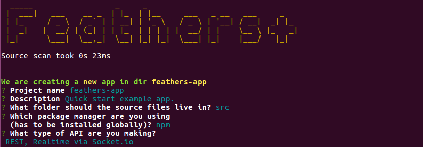
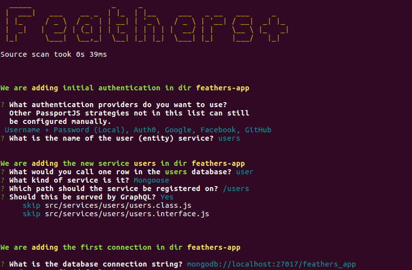
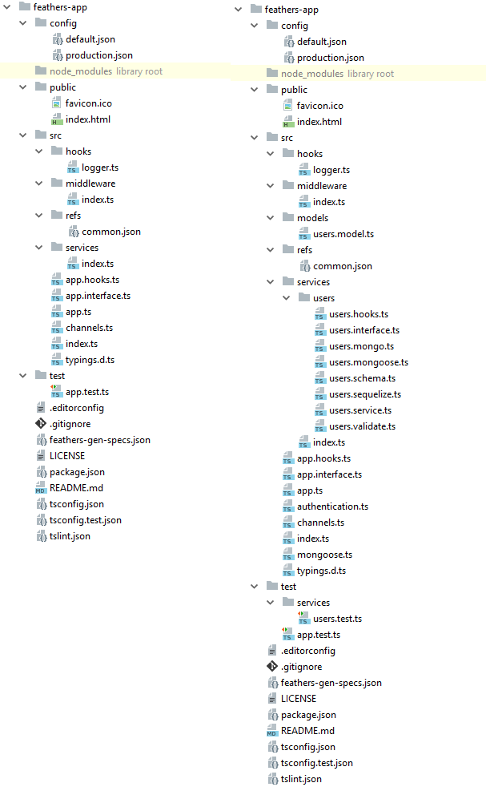
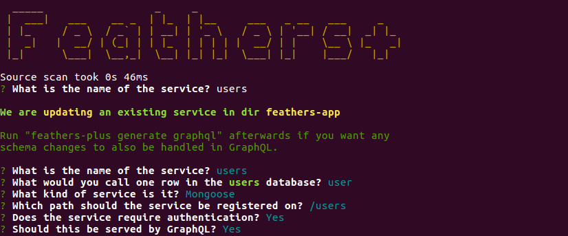
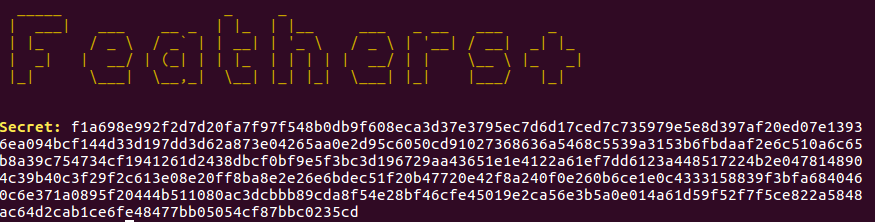
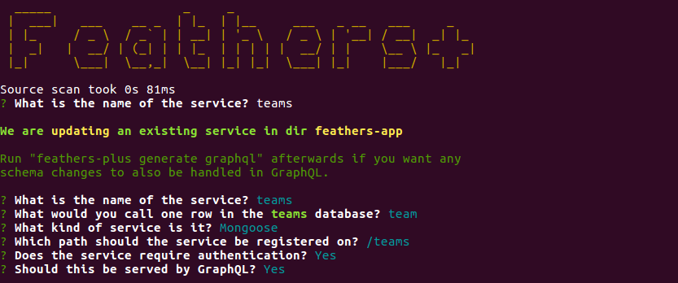
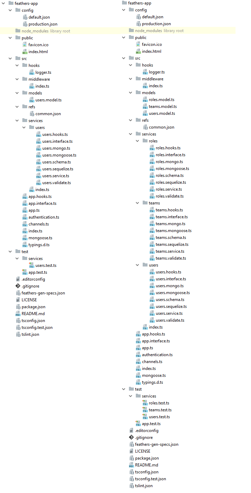
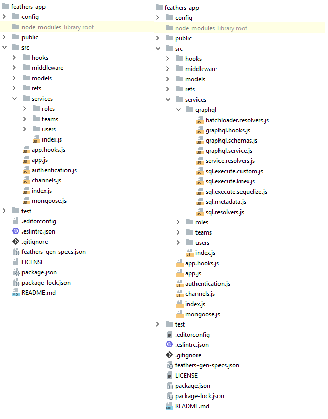
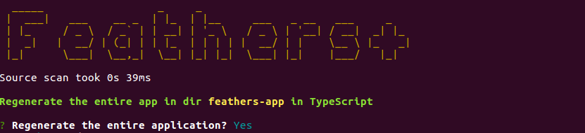
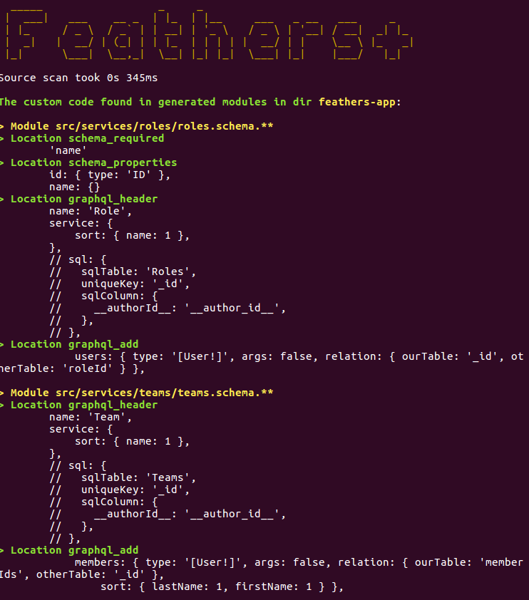

# Get Started

::: danger STOP
Until the generator is released, all references in the documentation to `@feathers-plus`
should be replaced with `@feathers-x`.
:::

## Comparing cli-plus to @feathersjs/cli

@feathers-plus/cli, a.k.a. "cli-plus", is similar to @feathersjs/cli in that:
- It uses the same commends, e.g. *generate service*.
- It prompts with the same questions, e.g. "Which path should the service be registered on?"
- It generates the same modules with essentially identical code.

However cli-plus also:
- Converts DB-agnostic JSON-schema models to the DB model each service is currently configured for. 
- Generates all the code needed for your GraphQL Query interface.
- Generates either JavaScript or TypeScript code; with semicolons or without. Converts apps between JS and TS.
- Regenerates you app without losing changes you've made. You stay up-to-date with enhancements and fixes.

## Installation

`npm i -g @feathers-plus/cli`

::: danger STOP
`generator-feathers-plus` is not automatically installed as a dependency
during the development period.

Do the following so that any change you make in @feathers-plus/generator-feathers-plus
will be immediately reflected in @feathers-plus/cli.

- Clone `@feathers-plus/generator-feathers-plus`.
- [Symlink](https://medium.com/trisfera/the-magic-behind-npm-link-d94dcb3a81af)
it into @feathers-plus/cli.
  - In @feathers-plus/generator-feathers-plus, run `npm link`.
  - In @feathers-plus/cli, run `npm link @feathers-plus/generator-feathers-plus`.
  The location containing the global @feathers-plus/cli will vary based on your OS.
  You can run `npm list -g` to see where global libraries are installed.
:::

## What the Generator Does

We've been writing code "by hand" in order to understand how basic Feathers works.
We will now start using Feathers generators since we have the background to understand what they produce.

#### Generators help eliminate boilerplate.

We've seen that Feathers, even when coded "by hand",
eliminates the majority of the boilerplate typically in a CRUD project.
Generators will eliminate even more.

:::tip Generators.
Feathers generators produce very little code because Feathers is so succinct.
You can easily understand the generated code because its no different from what we've been
coding "by hand" so far.
Some other frameworks make things “seem” easy by generating thousands of lines of code for you
and, in the process, making it almost impossible to implement anything not supported out of the box
by their generators.
:::

#### Generators structure your app.

The generated modules are structured as recommended by the Feathers team.

#### Generators handle database specifics.

The generators will generate code for different databases
so you don't have to investigate how to do so.

:::tip Switching between adapters.
You can change a service's database adapter while regenerating it.
This allows you, for example, to quickly mock up an app using the NeDB adapter,
and then convert it to Mongoose.
:::

### Use REST and GraphQL together

REST and GraphQL are totally different. Each is dope *if used for the right thing.*

cli-plus allows us to specify our services (a REST concept) along with their models and relations.
It then generates an additional GraphQL endpoint.

:::tip REST vs GraphQL 
FeathersJS, using cli-plus, now supports both REST and GraphQL architectural concepts and their query languages.
:::


## generate options

Let's generate a project having users who may be members of one or more teams.
We want to display teams with all their members

We first create a folder to contain the app, and then set its generator options.

```
mkdir feathers-app
cd feathers-app
feathers-plus generate options
```

#### Prompts


- `Source scan took 0s 23ms`.
The generator scans the app to identify any custom code.
This will always be very fast,
taking much less time than what the `Yoeman` tool needs to start up.

- `The generator will not change the following modules`.
The generator can refresh many of the modules in your app,
updating them to the latest version of the generator.
It does this without changing any of your custom code.

The listed modules are ones which the generator will not update.
Once they are written, the generator will not refresh them.
Any changes you make will remain.
If you delete any of them, the generator will replace them.

This list is displayed as a convenience, so you can refer to it anytime by running
*generate options* and cancelling.

- `You have additionally prevented the following modules from being changed.`
You can prevent a.k.a. "freeze" modules to prevent the generator from refreshing them.
You normally would not do so but its useful to have the option.
The frozen modules are listed here for convenience.

- `Generate TypeScript code?` Defaults to no. Otherwise JavaScript code is generated.

- `Use semicolons?` Defaults to yes. Otherwise semicolons are not generated at the end of statements.

- `View module changes and control replacement (not recommended)?`
Defaults to no.
This is a Yeoman feature which allows you to inspect the changes to be made to any module,
and to decide whether to apply it.
Its useful when you are exploring the raw details of what the generator writes.

#### Folder

The feathers-app folder now contains one module.


- **feathers-gen-specs.json** contains the information used to generate the app.

#### feathers-gen-specs.json

```js
{
  "options": {
    "ver": "1.0.0",
    "inspectConflicts": false,
    "semicolons": true,
    "freeze": [],
    "ts": false
  },
  "app": {},
  "services": {}
}
```

The generator keeps the prompts used to generate the app in `feathers-gen-specs.json`.
It can regenerate your entire app from that and the custom code it finds in the modules.

:::tip Regeneration.
The generator will default to your previous choices if you rerun *feathers-plus generate options*.
It will make any needed changes to all modules if you change any of the options.
:::

:::tip Optional
You need not run *feathers-plus generate options* if your app will be in JavaScript with semicolons.
:::

## generate app

Next we generate the scaffolding for the app.

```
feathers-plus generate app
```

#### Prompts



- `Project name`. Defaults to the folder name.

- `Description`. Optional description for the project.

- `What folder should the source files live in?`
Default `src`. The name of the folder containing the server code.

- `Which package manager are you using?` Default `npm`. The alternative is `yarn`.

- `What types of API are you making?` The options are
    - `REST` - HTTP. Default.
    - `Realtime via Socket.io` - Default. 
    - `Realtime via Primus`

#### Folders

The generator creates some
[JS modules](https://github.com/feathers-x/generator-feathers-plus/tree/master/examples/js/02-app/feathers-app/)
or [TS ones](https://github.com/feathers-x/generator-feathers-plus/tree/master/examples/ts/02-app/feathers-app/)
reflecting your choices.
The modules are properly wired together and structured as recommended by the Feathers team.

Below are the previous and the new app contents when JavaScript is generated.


and when TypeScript is generated.


- **config/** contains the configuration files for the app.
production.json values override default.json ones when in production mode,
i.e. when you run `NODE_ENV=production node path/to/your/server.js`.

- **node_modules/**. The generator installs the project dependencies here using either
npm, or yarn if that's installed.
The dependencies are enumerated in `package.json`.

- **public/** nontains the resources to be served.
A sample favicon and HTML file are included.

- **src/** contains the Feathers server.
    
    - **hooks/** contains your custom hooks,
    usually those general enough to be used with multiple services.
    A simple but useful logger is provided as an example.
        
    - **middleware/** contains your Express middleware.
    
    - **refs** contains definitions for fields which may reside in multiple database models.
        
    - **services/** will contain the services.
    
    - **index.?s** is used by node to start the app.
        
    - **app.?s** configures Feathers and Express.
    
    - **app.hooks.?s** contains hooks which are run for **all** services.
    
    - **channels.?s** contains the channels sending realtime events to clients.
    
    - **app.interface.ts** `??????????????????????????????????????`
    
    - **typings.d.ts** `??????????????????????????????????????????`
 
- **test/** contains the tests for the app.
app.test.?s tests that the index page appears, as well as 404 errors for HTML pages and JSON.

- **.editorconfig** is compatible with the [EditorConfig project](http://editorconfig.org/)
and helps developers define and maintain consistent coding styles among different editors and IDEs.

- **.gitignore** specifies intentionally untracked files which git, GitHub and other similar projects ignore.

- **feathers-gen-specs.json** contains the information used to generate the app.

- **LICENSE** contains the license so that people know how they are permitted to use it,
and any restrictions you're placing on it.
It defaults to the Feathers license.

- **package.json** contains information which npm, yarn
and other package managers need to install and use your package.

- **package-lock.json** is created by npm. It contains the versions of the module dependencies which are installed.
It exists only if the npm option is selected.

- **README.md** contains the documentation for the app.

- **tsconfig.json** `??????????????????????????????????????????`

- **tsconfig.test.json** `??????????????????????????????????????????`

- **tslint.json** `??????????????????????????????????????????`

- **yarn.lock**  is created by yarn. It contains the versions of the module dependencies which are installed.
It exists only if the yarn option is selected.


## Adding your code

`@feathersjs/cli`'s job ends when it generates the app scaffolding.
It doesn't know what you do afterwards with it.

`@feathers-plus/cli` (also known as `cli-plus`)is a `round-trip` generator.
Round-trip generators can take previously generated code, identify custom changes made to it,
and regenerate the code (maybe using different responses to the prompts)
along with those custom changes.

Cli-plus completes the round trip: *generate -> customize -> regenerate -> customize -> ...*.

The developer and cli-plus are in a more collaborative relationship.
They can work co-operatively on the scaffolding code.

#### Retain developer modifications

You will usually add your own code to the generated modules.
Cli-plus can identify such additional code, as long as certain standards are followed,
and it will retain that added code when regenerating modules.

Some of the code generated by cli-plus is identified as default code which you may want to customize.
Any customized code replacing the default code is also retained when modules are regenerated.

Let's look at a trivial example of these features.
@feathersjs/cli and cli-plus both create module `src/index.js` when *generate app* is run.
The cli-plus module has some extra decorative comments:
```js
server.on('listening', () => {
  // !<DEFAULT> code: listening_log
  logger.info('Feathers application started on http://%s:%d', app.get('host'), port);
  // !end
});

// !code: end // !end
```

Starting the server produces the expected log:
```
Feathers application started on http://localhost:3030
```

The lines between `// !<DEFAULT> code: listening_log` and `// !end` contain default code named `listening_log`.

The `// !code: end // !end` line identifies a location named `end` where additional lines may be added.

Let's change the code to:
```js
server.on('listening', () => {
  // !code: listening_log <-- Note that <DEFAULT> was removed.
  logger.info('Hello world on http://%s:%d', app.get('host'), port);
  // !end
});

// !code: end
logger.info('Initialization complete. Waiting for server to start.'); 
// !end
```

Starting the server now logs:
```
Initialization complete. Waiting for server to start.
Hello world on http://localhost:3030
```

:::danger A common error
Notice the `<DEFAULT>` tag was removed from listening_log along with changing the default code itself.
Any code changes you make in location_log will be lost on regeneration if you don't remove that `<DEFAULT>`.
:::

Let's say you originally ran *generate app* selecting only *socket.io* as a transport.
You then changed the code in `src/index.js` as described above.
Later on you realize you also need `REST` as a transport.
You can just rerun *generate app* with cli-plus and select both transports.
The regenerated modules will contain the code changes you made above.

#### Where can code be added?

The short answer is "just about anywhere".
Insertion points are available anywhere it makes any sense to add code.

Here is a typical `src/services/index.js`:
```js
// Configure the Feathers services. (Can be re-generated.)
let comment = require('./comment/comment.service');
let like = require('./like/like.service');
let post = require('./post/post.service');
let relationship = require('./relationship/relationship.service');
let user = require('./user/user.service');

let graphql = require('./graphql/graphql.service');
// !code: imports // !end
// !code: init // !end

let moduleExports = function (app) { // eslint-disable-line no-unused-vars
  app.configure(comment);
  app.configure(like);
  app.configure(post);
  app.configure(relationship);
  app.configure(user);

  app.configure(graphql);
  // !code: func_return // !end
};

// !code: exports // !end
module.exports = moduleExports;

// !code: funcs // !end
// !code: end // !end
```

All the modules follow the same standards, e.g. starting with `imports` and `init`,
and ending with `funcs` and `end`.
Functions tend to end with names like `func_return` so you can add code to them.
You can replace or mutate the required modules at `init` as well as adding any initialization code.
You can modify or replace the exported value at `exports`.

Its trivial to add insertion points into the generator, so create an issue if you need additional ones.
We'll add that insertion point, and you just regenerate the app to be able to use it.


#### More realistic code customization

The previous example gets the idea across but its too trivial to appreciate the impact of the feature.

Cli-plus generates a module for every service named `src/services/serviceName/serviceName. validate.js`.
It contains JSON-schema which may be used to validate record contents before create, update and patch calls.
Part of the code may be similar to:
```js
const base = merge({},
  // !<DEFAULT> code: base
  {
    $schema: "http://json-schema.org/draft-05/schema",
    title: "User",
    description: "User database.",
    required: [
      "uuid",
      "email",
      "firstName",
      "lastName"
    ],
    properties: {
      _id: {
        type: ID
      },
      uuid: {
        type: ID
      },
      email: {
        type: "string"
      },
      firstName: {
        type: "string", maxLength: 30,
      },
      lastName: {
        type: "string", maxLength: 30,
      }
    }
  },
  // !end
  // !code: base_more // !end
);
```

This 'base' JSON-schema is derived from the **service model**.
(The service model is a new concept cli-plus introduces which is explained below.)
It is the basis for the validation schemas used for the different types of calls.

The developer may replace the default code named `base` to suit his use case.

It would probably be better however to mutate the default schema by adding, mutation or removing
properties by adding custom code to `base_more`, e.g.:
```js
// !code: base_more
{
  properties: {
    firstName: { minLength: 45 },
    initial: { type: 'string', maxLength: 1 }
  }
}
// !end
```
This would be better because now, when you change the `service model`,
cli-plus will make appropriate changes to the base schema in its default code.
This is better than remembering to modify the base schema manually every time you change the service model.

#### GraphQL examples

One of the main features of cli-plus is its ability to generate a GraphQL endpoint as well as the necessary resolvers.
A large number of carefully coded resolvers need to defined in a reasonably sized project,
so automatically generating these resolvers is a valuable feature.

However resolvers often have to be customized in unexpected ways.
You may need to change the sort order.
You may need to set props in `context.params` for certain hooks.
There is no practical end to the potential customizations.

Here are some code snippets in src/services/graphql/service.resolvers.js
which cli-plus may generate for a GraphQL endpoint:
```js
    // Feathers service resolvers
    User: {

      // comments: [Comment!]
      comments:
        // !<DEFAULT> code: resolver-User-comments
        (parent, args, content, ast) => {
          const feathersParams = convertArgs(args, content, ast, {
            query: { authorUuid: parent.uuid, $sort: undefined }, paginate: false
          });
          return comments.find(feathersParams).then(extractAllItems);
        },
        // !end

      // fullName: String!
      fullName:
        // !<DEFAULT> code: resolver-User-fullName-non
        (parent, args, content, ast) => { throw Error('GraphQL fieldName User.fullname is not calculated.'); },
        // !end

      // posts(query: JSON, params: JSON, key: JSON): [Post!]
      posts:
        // !<DEFAULT> code: resolver-User-posts
        (parent, args, content, ast) => {
          const feathersParams = convertArgs(args, content, ast, {
            query: { authorUuid: parent.uuid, $sort: undefined }, paginate: false
          });
          return posts.find(feathersParams).then(extractAllItems);
        },
        // !end
    },
```
You can customize them as you wish, by defining a `$sort` order for example.

`fullname` is a calculated field.
Cli-plus, rather than inventing some specialized way for you to indicate what the calculation is,
just creates some default code for you to replace with the calculation.
For example
```js
      // fullName: String!
      fullName:
        // !code: resolver-User-fullName-non
        (parent, args, content, ast) => `${parent.firstName} ${parent.lastName}`,
        // !end
```

#### Avoiding customization

You can have cli-plus generate modules and then prevent it from making changes thereafter to some of them,
by using the `options.freeze` prop in `feathers-gen-specs.json`.

#### Some details

The leaders for custom code may be : `// !code:`, `// !<> code:`, `//!code:`, or `// ! code:`.

The trailers may be: `// !end`, or `//!end`


## generate authentication

Let us next generate authentication for the app. This will generate
- The authentication code itself.
- A service for the users table.
- A connection string for the database containing the users table.

```
feathers-plus generate authentication
```

#### Prompts



- Authentication questions:

    - `What authentication providers do you want to use?` Choose one or more of:
    Local, Auth0, Google, Facebook and Github.
    - `What is the name of the user (entity) service?` Default users.
    The name of the users table.
    
- Service questions:

    - `What would you call one row in the <users> database?` Our default is user.
    This response is used to form the names of GraphQL types e.g.`User` and `[User!]`.
    - `What kind of service is it?` Default is NeDB.
    Choose one of: Custom service, Memory, NeDB, MongoDB, Mongoose, Sequelize, KnexJS.
    - `Which path should the service be registered on?` Default `/users`.
    - `Should this be served by GraphQL?` Default yes.
    Should this service be included in GraphQL Queries?  
    
- Connection question:

    - `What is the database connection string?` How do we attach to the database?
    The default is the standard connection string for that database.    


#### Folders

The generator adds some modules to the
[JS folder](https://github.com/feathers-x/generator-feathers-plus/tree/master/examples/js/03-authentication/feathers-app/)
or [TS one](https://github.com/feathers-x/generator-feathers-plus/tree/master/examples/ts/03-authentication/feathers-app/).

Below are the previous and the new app contents when JavaScript is generated.


and when TypeScript is generated.



- **models/**. Some database adapters require models for their tables.
Those models are located here.

    - **users.model.?s** is the model for the users table.
    
- **services/users** contains code for the users service.

    - **users.service/?s** configures the service.
    - **users.hooks.?s** identifies the hooks to be used with the service.
    - **users.schema.?s** contains the database agnostic JSON-schema model for the service.
    When a service is initially created. the module contains an empty model as no model has yet
    been defined.
    - **users.mongo.?s, users.mongoose.?s, users.sequelize.?s** contain the JSON-schema model
    in users.schema.?s converted to a MongoDB, Mongoose or Sequelize model.
    - **users.validate.?s** contains schemas to validate data for create, patch and update service calls.
    - **users.interface.ts** `???????????????????????????????????????????????`
    
- **authentication.?s** contains the authentication code.

- **mongoose.?s** configures the Mongoose adapter.
knex.?s, mongodb.?s, rethinkdb.?s, sequelize.?s and sequelize-mssql.?s models would also be created as needed.

- **test/service/users.test.?s** tests the service can be started. 

:::tip All those modules
Only one of users.mongo.?s, users.mongoose.?s, users.sequelize.?s is being used at any time.
The code generated for users.service.?s and users.model.?s call the right modules for the **What kind of service is it?**
selected.

The modules are all generated so you may include all the custom code you need for all of them.
This allows you to rerun *generate authentication* or *generate service* at any time to change databases.
:::

## Feathers Models

Some database systems use a schema
to describe how the data in a database table or collection is organized,
as well as how the different schemas relate to one another.
Unfortunately, schemas are normally not shareable between different databases.
The Mongoose database adapter, for example, will not understand a schema
written for the Sequelize database adapter.

However if you use **Feathers Models**,
cli-plus can automatically convert your Feathers model into the schema expected by
a particular database adapter.

With Feathers service adapters and Feathers Models you can connect to the most popular databases and
query them with a unified interface no matter which one you use.
This makes it easy to swap databases and use entirely different DBs in the same app
without changing your application code.

#### JSON-schema

Feathers Models are based on [JSON-schema](http://json-schema.org/).
JSON-schema is the most popular way to describe the structure of JSON
data and, since JSON data is essentially just plain old JavaScript objects,
this makes JSON-schema a great fit for Feathers Models.

JSON-schema:

- has the widest adoption among all standards for JSON validation.
- is very mature (current version is 6).
- covers a big part of validation scenarios.
- uses easy-to-parse JSON documents for schemas.
- is platform independent.
- is easily extensible.
- JSON-schema is easy to write, and there are some great
  [tutorials](https://code.tutsplus.com/tutorials/validating-data-with-json-schema-part-1--cms-25343).

The [`validateSchema`](https://feathers-plus.github.io/v1/feathers-hooks-common/index.html#validateSchema)
common hook already uses JSON-data for verification.

#### Adding the Feathers Model

The users service was created with an empty Feathers model, i.e. it has no fields.
Let's now define a model for it in module **src/services/users/users.schema.?s**.
The guide contains detailed information on defining models.

Our resulting model contains 4 fields, and an id field will be added automatically.

```js
// Define the model using JSON-schema
let schema = {
  // !<DEFAULT> code: schema_header
  title: 'Users',
  description: 'Users database.',
  // !end
  // !code: schema_definitions // !end

  // Required fields.
  required: [
    // !code: schema_required
    'email',
    'firstName',
    'lastName',
    'roleId'
    // !end
  ],
  // Fields with unique values.
  uniqueItemProperties: [
    // !code: schema_unique // !end
  ],

  // Fields in the model.
  properties: {
    // !code: schema_properties
    id: { type: 'ID' },
    email: {},
    firstName: {},
    lastName: {},
    password: {},
    roleId: { type: 'ID' }
    // !end
  },
  // !code: schema_more // !end
};
```

- **type: 'ID'** indicates the field contain a key (**id**) or a foreign key (**roleId**),
that is, the field contains the key to another record.

- **type: {}** The default is 'string'.


#### Regenerating the Service

We can now regenerate the service. The generator will detect the Feathers model and use it to
"fill in" modules such as users.mongoose.?s and users.validate.?s.

```
feathers-plus generate service
```



The responses used to create the users service are the defaults presented now.
Just Enter through all the prompts.

The folder organization will not change, however all modules now reflect the Feathers model.
**src/services/users/users.mongoose.js** is an example:

```js
/* eslint quotes: 0 */
// Defines Mongoose model for service `users`. (Can be re-generated.)
const merge = require('lodash.merge');
// eslint-disable-next-line no-unused-vars
const mongoose = require('mongoose');
// !code: imports // !end
// !code: init // !end

let moduleExports = merge({},
  // !<DEFAULT> code: model
  {
    email: {
      type: String,
      required: true
    },
    firstName: {
      type: String,
      required: true
    },
    lastName: {
      type: String,
      required: true
    },
    password: String,
    roleId: {
      type: mongoose.Schema.Types.ObjectId,
      required: true
    }
  },
  // !end
  // !code: moduleExports // !end
);

// !code: exports // !end
module.exports = moduleExports;

// !code: funcs // !end
// !code: end // !end
```

As is **src/services/users.users.validate.js**:

```js
/* eslint quotes: 0 */
// Validation definitions for validateSchema hook for service `users`. (Can be re-generated.)
const { validateSchema } = require('feathers-hooks-common');
const merge = require('lodash.merge');
const ajv = require('ajv');
// !code: imports // !end
// !code: init // !end

// !<DEFAULT> code: set_id_type
// eslint-disable-next-line no-unused-vars
const ID = 'string';
// !end

let base = merge({},
  // !<DEFAULT> code: base
  {
    title: "Users",
    description: "Users database.",
    required: [
      "email",
      "firstName",
      "lastName",
      "roleId"
    ],
    uniqueItemProperties: [],
    properties: {
      id: {
        type: ID
      },
      email: {
        type: "string"
      },
      firstName: {
        type: "string"
      },
      lastName: {
        type: "string"
      },
      password: {
        type: "string"
      },
      roleId: {
        type: ID
      }
    }
  },
  // !end
  // !code: base_more // !end
);
// !code: base_change // !end

let create = merge({},
  base,
  // !code: create_more // !end
);

let update = merge({},
  base,
  // !code: update_more // !end
);

let patch = merge({},
  base,
  { required: undefined },
  // !code: patch_more // !end
);
// !code: all_change // !end

let validateCreate = options => {
  // !<DEFAULT> code: func_create
  return validateSchema(create, ajv, options);
  // !end
};

let validateUpdate = options => {
  // !<DEFAULT> code: func_update
  return validateSchema(update, ajv, options);
  // !end
};

let validatePatch = options => {
  // !<DEFAULT> code: func_patch
  return validateSchema(patch, ajv, options);
  // !end
};

let quickValidate = (method, data, options) => {
  try {
    if (method === 'create') { validateCreate(options)({ type: 'before', method: 'create', data }); }
    if (method === 'update') { validateCreate(options)({ type: 'before', method: 'update', data }); }
    if (method === 'patch') { validateCreate(options)({ type: 'before', method: 'patch', data }); }
  } catch (err) {
    return err;
  }
};
// !code: validate_change // !end

let moduleExports = {
  create,
  update,
  patch,
  validateCreate,
  validateUpdate,
  validatePatch,
  quickValidate,
  // !code: moduleExports // !end
};

// !code: exports // !end
module.exports = moduleExports;

// !code: funcs // !end
// !code: end // !end
```

## generate secret

*generate authentication* added a secret to package.json:
```js
{
  "host": "localhost",
  "port": 3030,
  "public": "../public/",
  "paginate": {
    "default": 10,
    "max": 50
  },
  "authentication": {
    "secret": "1a3808d2bfd79fc3370b0bdcf76ee95b4f9833894041aeb4f0964b99a9a02929c6cdc64180c4a55a02fd6245a6ee462501c40def69d3984ce17f93967ea389918e09fad8ea1efeb7579f4515d66fd965a235604e5c356a6a71c4f999cba05d8ef56eee787364fe086741099bd83cbef21e983782d0d5032ea6d9475518b2521388df49a460b430d76494076772fe57bb9725be1c23dd9f704daba8b4c86340173314860cccec9bc39b25a90390ac5d60823737d6a3d5067a7a44994f22f2f7268b59732853084eccada87d66962fe8d239f16d1fa7c795500e23bd56dc8d64357f9fd33631649a3cba4b5ce50d8b47a7c4117ac84f2aed13157e1447e21bb99c",
    // ...
  },
  "mongodb": "mongodb://localhost:27017/feathers_app"
}
```

If you need to create a new secret, run
```
feathers-plus generate secret
```



and paste the new secret into package.json.

## generate service

Let's add 2 new services using:

```
feathers-plus generate service
```

First let's add a **roles** service.


And then a **teams** service.


#### Adding the Feathers Models

Now we add a Feathers model to src/services/roles/roles.schema.?s:

```js
let schema = {
  // !<DEFAULT> code: schema_header
  title: 'Roles',
  description: 'Roles database.',
  // !end
  // !code: schema_definitions // !end

  // Required fields.
  required: [
    // !code: schema_required
    'name'
    // !end
  ],
  // Fields with unique values.
  uniqueItemProperties: [
    // !code: schema_unique // !end
  ],

  // Fields in the model.
  properties: {
    // !code: schema_properties
    id: { type: 'ID' },
    name: {}
    // !end
  },
  // !code: schema_more // !end
};
```

And one to src/services/teams/teams.schema.?s:

```js
// Define the model using JSON-schema
let schema = {
  // !<DEFAULT> code: schema_header
  title: 'Teams',
  description: 'Teams database.',
  // !end
  // !code: schema_definitions // !end

  // Required fields.
  required: [
    // !code: schema_required
    'name',
    'members'
    // !end
  ],
  // Fields with unique values.
  uniqueItemProperties: [
    // !code: schema_unique // !end
  ],

  // Fields in the model.
  properties: {
    // !code: schema_properties
    id: { type: 'ID' },
    name: {},
    members: {
      type: 'array',
      items: [{ type: 'ID' }]
    }
    // !end
  },
  // !code: schema_more // !end
};
```

#### Regenerating the Services

And regenerate, accepting the defaults by pressing Enter.
```
feathers-plus generate service
```

For **roles**


and **teams**.



The Mongoose models now reflects the Feathers model:
```js
/* eslint quotes: 0 */
// Defines Mongoose model for service `roles`. (Can be re-generated.)
const merge = require('lodash.merge');
// eslint-disable-next-line no-unused-vars
const mongoose = require('mongoose');
// !code: imports // !end
// !code: init // !end

let moduleExports = merge({},
  // !<DEFAULT> code: model
  {
    name: {
      type: String,
      required: true
    }
  },
  // !end
  // !code: moduleExports // !end
);

// !code: exports // !end
module.exports = moduleExports;

// !code: funcs // !end
// !code: end // !end
```

```js
/* eslint quotes: 0 */
// Defines Mongoose model for service `teams`. (Can be re-generated.)
const merge = require('lodash.merge');
// eslint-disable-next-line no-unused-vars
const mongoose = require('mongoose');
// !code: imports // !end
// !code: init // !end

let moduleExports = merge({},
  // !<DEFAULT> code: model
  {
    name: {
      type: String,
      required: true
    },
    members: [
      String
    ]
  },
  // !end
  // !code: moduleExports // !end
);

// !code: exports // !end
module.exports = moduleExports;

// !code: funcs // !end
// !code: end // !end
```

#### Folders

The generator adds some modules to the
[JS folder](https://github.com/feathers-x/generator-feathers-plus/tree/master/examples/js/06-service/feathers-app/)
or [TS one](https://github.com/feathers-x/generator-feathers-plus/tree/master/examples/ts/06-service/feathers-app/).

Below are the previous and the new app contents when JavaScript is generated.


and when TypeScript is generated.



- **models/teams.model.?s** contains the model for teams.

- **services/teams** contains modules for teams.

- **test/services/teams.test.?s** tests the team service is configured.

## GraphQL

There is a good deal of literature available on what GraphQL is, on why it is good,
and how it compares to REST.

- [Why GraphQL](https://medium.com/@ajaysaini.official/why-graphql-886ba866ae75)
- [Why GraphQL is the future](https://dev-blog.apollodata.com/why-graphql-is-the-future-3bec28193807)
And what it means for you.
- [GraphQL vs. REST](https://dev-blog.apollodata.com/graphql-vs-rest-5d425123e34b)
Two ways to send data over HTTP: What’s the difference?
- [GraphQL vs REST: Overview](https://philsturgeon.uk/api/2017/01/24/graphql-vs-rest-overview/)

Some take-aways are:

- REST and GraphQL are totally different.
- GraphQL isn't a magic bullet, nor is it *better*.
- You can definitely use both at the same time.
- GraphQL is dope *if used for the right thing*.

**cli-plus** automatically generates a GraphQL endpoint for your Feathers services,
so you may make queries using either REST or GraphQL, even simultaneously.

### Our app as an example

We've taken the app we've been working on and
[produced a GraphQL example ](https://github.com/feathers-x/generator-feathers-plus/tree/master/examples/js/07-graphql-example/feathers-app).
You can run it yourself with `npm i` and `npm start`.

- We converted the services to NeDB so the example is easy to run.
- We added some additional information to the service schemas.
- We initialize the NeDB tables in src/index.?s.
- We also run some GraphQL queries there.

#### Types

When you run
::: warning STOP
Don't run this command right now. Its shown here for illustrative purposes.
:::

```
feathers-plus generate graphql
```

GraphQL types are generated, along with the fields on those types.
The types generated for our example are:

```
type Role {
  id: ID
  name: String!
}
 
type Team {
  id: ID
  name: String!
  memberIds: [String]
  members: [User!]
}
 
type User {
  id: ID
  email: String!
  firstName: String!
  lastName: String!
  password: String
  roleId: ID!
  fullName: String!
  role(query: JSON, params: JSON, key: JSON): Role
  teams(query: JSON, params: JSON, key: JSON): [Team!]
}
 

type Query {
  getRole(key: JSON, query: JSON, params: JSON): Role
  findRole(query: JSON, params: JSON): [Role]!
  getTeam(key: JSON, query: JSON, params: JSON): Team
  findTeam(query: JSON, params: JSON): [Team]!
  getUser(key: JSON, query: JSON, params: JSON): User
  findUser(query: JSON, params: JSON): [User]!
}
```

The **getRole**, **findRole**, etc. are the GraphQL queries you can make.
The other **type** expand what the queries can return.

Notice the API for the types is the Feathers service API by default.
**key** is the Feathers **id**, **query** is Feathers **params.query**,
and **params** is anything else in Feathers **params**.

Using the same API reduces what you have to learn,
and makes the interface between Feathers and GraphQL seamless.

::: tip JSON
You may be perplexed by **JSON** as its not one of GraphQL's scalar types.
It is a custom type added by cli-plus.
:::

In GraphQL notation
- **String** is a string or **null**.
- **String!** is a string.
- **[String]** is an array of strings, some of which may be **null**. It may also be **null** instead of an array.
- **[String]!** is similar to **[String]** but it cannot be **null**.
- **[User!]** is an array of **User** objects. None of the elements may be **null**.

#### Making our first request

The client (or the server) can then make a request like
```
const graphql = app.service('graphql');
const myQuery = '{
  findUser(query: {}) {
    firstName
    lastName
    fullName
    email
    role { name }
    teams { name }
  }
}';
                  
const result = await graphql.find({ query: { query: myQuery } })
```

::: tip GraphiQL
Why the two `query` in `{ query: { query: myQuery } }`?
The first is needed by the Feathers service API of course.
The second one is required to use [GraphiQL](https://github.com/graphql/graphiql),
the popular graphical interactive in-browser GraphQL IDE.
You can use GraphiQL to test your queries from the browser.
:::

The request returns data of the form:
```
{
  total: 3,
  limit: 10,
  skip: 0,
  data: {
    findUser: [
      {
        firstName: 'Jack',
        lastName: 'Doe',
        fullName: 'Jack Doe',
        email: 'jack-doe@gmail.com',
        role: { name: 'normal' },
        teams: [ { name: 'beta' } ]
      }, {
        firstName: 'Jane',
        lastName: 'Doe',
        fullName: 'Jane Doe',
        email: 'jane-doe@gmail.com',
        role: { name: 'normal' },
        teams: [ { name: 'alpha' }, { name: 'beta' } ]
      }, {
        firstName: 'John',
        lastName: 'Doe',
        fullName: 'John Doe',
        email: 'john-doe@gmail.com',
        role: { name: 'admin' },
        teams: [ { name: 'alpha' } ]
      }
    ]
  }
}
```

Some of the advantages of GraphQL are becoming clear:

- The complete response was returned in a single request.
- The client asks only for the data it needs.
- The client does not know, nor does it care how the data is organized,
or what needs to be done to accumulate the complete response.
- No versioning exists.

#### Making another request

And a request like:
```
{
  findTeam(query: {}) {
    name
    memberIds
    members {
      fullName
      role { name }
    }
  }
}
```

returns
```
{
  total: 2,
  limit: 10,
  skip: 0,
  data: {
    findTeam: [
      {
        name: 'alpha',
        memberIds: [ 'gXWQs77x3X1fZjVg', 'hVJjFMnxCfHnIBS0' ],
        members: [
          { fullName: 'Jane Doe', role: { name: 'normal' } },
          { fullName: 'John Doe', role: { name: 'admin' } }
        ]
      }, {
        name: 'beta',
        memberIds: [ '6bJA2ONlIEpA8IX8', 'hVJjFMnxCfHnIBS0' ],
        members: [
          { fullName: 'Jack Doe', role: { name: 'normal' } },
          { fullName: 'Jane Doe', role: { name: 'normal' } }
        ]
      }
    ]
  }
}
```

#### Resolvers

GraphQL expects to find **resolvers** to stitch the reponse together.
Each resolver is a function which joins one type to another, or which calculates a dervived field.

`feathers-plus generate graphql` generates the resolver code needed for your GraphQL endpoint,
and it generates up to 3 versions of the resolvers
- One uses [normal Feathers service calls](https://github.com/feathers-x/generator-feathers-plus/blob/master/examples/js/07-graphql-example/feathers-app/src/services/graphql/service.resolvers.js).
- Another uses [batch-loaders](https://github.com/feathers-x/generator-feathers-plus/blob/master/examples/js/07-graphql-example/feathers-app/src/services/graphql/batchloader.resolvers.js).
- And the final one uses raw SQL statements.

The resolvers usually require a **lot** of code which must be meticulously correct.
You will save a **lot** of time by having the generator write the resolvers.

For example, this is the resolver code generated for our simplist example for the straightforward case ---
using normal Feathers service calls.

```js
/* eslint-disable no-unused-vars, indent */
// Define GraphQL resolvers using only Feathers services. (Can be re-generated.)
// !code: imports // !end
// !code: init // !end

let moduleExports = function serviceResolvers(app, options) {
  const {convertArgsToFeathers, extractAllItems, extractFirstItem} = options;
  // !<DEFAULT> code: extra_auth_props
  const convertArgs = convertArgsToFeathers([]);
  // !end

  // !<DEFAULT> code: services
  let roles = app.service('/roles');
  let teams = app.service('/teams');
  let users = app.service('/users');
  // !end

  let returns = {

    Role: {
    },

    Team: {

      // members: [User!]
      members:
        // !<DEFAULT> code: resolver-Team-members
        (parent, args, content, ast) => {
          const feathersParams = convertArgs(args, content, ast, {
            query: { _id: { $in: parent.memberIds }, $sort: 
              {
                lastName: 1,
                firstName: 1
              } }, paginate: false
          });
          return users.find(feathersParams).then(extractAllItems);
        },
        // !end
    },

    User: {

      // fullName: String!
      fullName:
        // !code: resolver-User-fullName-non
        (parent, args, content, ast) => `${parent.firstName} ${parent.lastName}`,
        // !end

      // role(query: JSON, params: JSON, key: JSON): Role
      role:
        // !<DEFAULT> code: resolver-User-role
        (parent, args, content, ast) => {
          const feathersParams = convertArgs(args, content, ast, {
            query: { _id: parent.roleId }, paginate: false
          });
          return roles.find(feathersParams).then(extractFirstItem);
        },
        // !end

      // teams(query: JSON, params: JSON, key: JSON): [Team!]
      teams:
        // !<DEFAULT> code: resolver-User-teams
        (parent, args, content, ast) => {
          const feathersParams = convertArgs(args, content, ast, {
            query: { $sort: 
              {
                name: 1
              } }, paginate: false
          });

          if (!(content.cache.User && content.cache.User.teams)) {
            content.cache.User = content.cache.User || {};
            content.cache.User.teams = teams.find(feathersParams).then(extractAllItems);
          }

          return Promise.resolve(content.cache.User.teams)
            .then(res => res.filter(rec => rec.memberIds.indexOf(parent._id) !== -1));
        },
        // !end
    },

    // !code: resolver_field_more // !end

    Query: {

      // !<DEFAULT> code: query-Role
      // getRole(query: JSON, params: JSON, key: JSON): Role
      getRole(parent, args, content, ast) {
        const feathersParams = convertArgs(args, content, ast);
        return roles.get(args.key, feathersParams).then(extractFirstItem);
      },

      // findRole(query: JSON, params: JSON): [Role!]
      findRole(parent, args, content, ast) {
        const feathersParams = convertArgs(args, content, ast, { query: { $sort: {   name: 1 } } });
        return roles.find(feathersParams).then(paginate(content)).then(extractAllItems);
      },
      // !end

      // !<DEFAULT> code: query-Team
      // getTeam(query: JSON, params: JSON, key: JSON): Team
      getTeam(parent, args, content, ast) {
        const feathersParams = convertArgs(args, content, ast);
        return teams.get(args.key, feathersParams).then(extractFirstItem);
      },

      // findTeam(query: JSON, params: JSON): [Team!]
      findTeam(parent, args, content, ast) {
        const feathersParams = convertArgs(args, content, ast, { query: { $sort: {   name: 1 } } });
        return teams.find(feathersParams).then(paginate(content)).then(extractAllItems);
      },
      // !end

      // !<DEFAULT> code: query-User
      // getUser(query: JSON, params: JSON, key: JSON): User
      getUser(parent, args, content, ast) {
        const feathersParams = convertArgs(args, content, ast);
        return users.get(args.key, feathersParams).then(extractFirstItem);
      },

      // findUser(query: JSON, params: JSON): [User!]
      findUser(parent, args, content, ast) {
        const feathersParams = convertArgs(args, content, ast, { query: { $sort: {   lastName: 1,   firstName: 1 } } });
        return users.find(feathersParams).then(paginate(content)).then(extractAllItems);
      },
      // !end
      // !code: resolver_query_more // !end
    },
  };

  // !code: func_return // !end
  return returns;
};

// !code: more // !end

// !code: exports // !end
module.exports = moduleExports;

function paginate(content) {
  return result => {
    content.pagination = !result.data ? undefined : {
      total: result.total,
      limit: result.limit,
      skip: result.skip,
    };

    return result;
  };
}

// !code: funcs // !end
// !code: end // !end
```

### Comprehensive example

[@feathers-plus/cli-generator-example](https://github.com/feathers-x/cli-generator-example)
contains a comprehensive GraphQL example produced with cli-plus.
Its based on the following data schema


It has a test-harness running on the browser


You can select queries, modify them, run them and see the results.

The repo contains examples in both JavaScript and TypeScript,
implementing the same test harness for:
- Feathers service resolvers used with the NeDB database.
- BatchLoader based resolvers used with the NeDB database.
- Feathers service resolvers used with Sequelize backed by the SQLite database.
- BatchLoader based resolvers used with Sequelize backed by the SQLite database.
- Resolvers producing raw SQL statements used with Sequelize backed by the SQLite database.
 
You will note how many lines of code are required to implement GraphQL resolvers,
and thankfully cli-plus generates them.

## GraphQL extensions to models

Now that we understand what we expect to implement with the GraphQL endpoint,
so let's see how to accomplish it.

src/services/users/users.schema.?s contains an outline of GraphQL extensions
to the users Feathers model.
```js
// Define optional, non-JSON-schema extensions.
let extensions = {
  // GraphQL generation.
  graphql: {
    // !<DEFAULT> code: graphql_header
    // name: 'User',
    // service: {
    //   sort: { _id: 1 },
    // },
    // sql: {
    //   sqlTable: 'Users',
    //   uniqueKey: '_id',
    //   sqlColumn: {
    //     __authorId__: '__author_id__',
    //   },
    // },
    // !end
    discard: [
      // !code: graphql_discard // !end
    ],
    add: {
      // !<DEFAULT> code: graphql_add
      // __author__: { type: '__User__!', args: false, relation: { ourTable: '__authorId__', otherTable: '_id' } },
      // !end
    },
    // !code: graphql_more // !end
  },
};
```
Let's start filling it in.

### Metadata

- **name** The name of the GraphQL type for this service. It defaults to your answer in *generate service* for
*What would you call one row in the users database?*

```js
name: 'User',
```

:::tip Being included in the GraphQL endpoint
The service will not be included in the GraphQL endpoint until its given a **name**.
:::

- **service** This property must be defined for Feathers service-based resolvers to be generated.

    - **service.sort** How to sort the **users** records if **users** form the top level of the response.

```js
service: {
  sort: { lastName: 1, firstName: 1 },
},
```
    
:::tip Queries
Two queries are generated for each service.
**getUser** is similar to Feathers users.get(id) and returns a single user.
**findUser** is similar to users.find({ query: {...} }) and returns multiple users.

You can implement other queries by adding custom code to the resolvers.
:::   

- **sql** This property must be defined for resolvers producing raw SQL statements to be generated.
We will talk about SQL statement generation in another section.

- **discard** Fields not to be included in the GraphQL endpoint.
If our users service had included a password field, it would be reasonable to have
```js
discard: [
  // !code: graphql_discard
  'password' 
  // !end
],
``` 

- **add** defines how records are joined to the users service,
and how any computed fields are calculated.

Our Feathers model alone would produce the GraphQL type
```js
type User {
  id: ID
  email: String!
  firstName: String!
  lastName: String!
  password: String
  roleId: ID!
}
```

Let's continue to expand the model to include joined records and a computed field.

### Computed fields

You need only mention that a computed field exists.
```js
    add: {
      // !code: graphql_add
      fullName: { type: 'String!', args: false },
      // !end
    },
```

- **fullName** The name of the computed field.
- **String!** Its a string. null is not allowed.
- **args: false** The field is not permitted arguments in the GraphQL Query.
    
Note we do not say how the field is calculated. cli-plus will generate a resolver function like
```js
User: {
  // fullName: String!
  fullName:
    // !<DEFAULT>code: resolver-User-fullName-non
    (parent, args, content, ast) => { throw Error('GraphQL fieldName User.fullName is not calculated.'); },
    // !end
}    
```    

And we customize it with the calculation. 
```js
User: {
  // fullName: String!
  fullName:
    // !code: resolver-User-fullName-non
    (parent, args, content, ast) => `${parent.firstName} ${parent.lastName}`,
    // !end
}    
``` 

After defining the calculated field, our GraphQL type is
```
type User {
  id: ID
  email: String!
  firstName: String!
  lastName: String!
  password: String
  roleId: ID!
  fullName: String!
}
``` 

### Joining records

Our schema is


To each **users** record we can attach
- The single **roles** record referred to in its **users.roleId**.
- All the **teams** records containing its **users.id** in their **teams.memberIds[]**.

To each **roles** record we can attach
- All the **users** record containing its **roles.id** in **users.roleId**.

To each **teams** record we can attach
- All the **users** records whose **users.id** is contained in its **teams.memberIds**.

#### Joining Roles record to Users

Our users model contains **roleId**, a foreign key to the roles model.
We can join the proper roles record to the user record with
```js
add: {
  // !code: graphql_add
  role: { type: 'Role', args: true, relation: { ourTable: 'roleId', otherTable: '_id' } },
  // !end
},
```

- **role** The property to contain the roles record.
- **type** Identifies the type of object the resolver function will return.
Here its returns a roles object or null.

:::tip The GraphQL type system identifies the shape of a field
- **Role** The field is a Role object. It may also be null.
- **Role!** Its a Role object. null is not allowed.
- **[Role]** Its an array of Role objects. An element may be null and, instead of an array, the field itself may be null.
- **[Role!]** Like [Role] but the elements may not be null. null is still allowed instead of an array.
- **{Role]!** Like [Role] but an array must exist.
- **[Role!]!** Like [Role] but an array must exist and no element may be null.
:::

- **args** Determines if arguments are allowed for the field allowed in the GraphQL Query.
cli-plus always generates Feathers compatible arguments:
```
role(query: JSON, params: JSON, key: JSON): Role
```

- Where
    - **key** Equivalent to Feathers id, i.e. users.get(id).
    - **query** Equivalent to Feathers query, i.e. users.find({ query: {...} }).
    - **params** Equivalent to Feathers params, i.e. users.find(params).
    The **query** and **params** arguments are merged together as expected for Feathers.
    
- **relation** The corresponding fields in each model which define the relationship.
    - **ourTable** The field name in the model whose metadata we are defining.
    - **otherTable** The field name in the other service.
    
:::tip Resolver functions
If ourTable and otherTable are both scalars, the resolver function will similar to
```js
roles.find({ query: { _id: parent.roleId }, paginate: false })
```

If ourTable had been an array, then the resolver function would be like
```js
roles.find({ query: { _id: { $in: parent.roleIds } }, paginate: false })
```

If otherTable is an array, the resolver function will be similar to
```js
if (!(content.cache.User && content.cache.User.teams)) {
 content.cache.User = content.cache.User || {};
 content.cache.User.teams =
   teams.find({ query: {...}, paginate: false })
     .then(extractAllItems);
}

return Promise.resolve(content.cache.User.teams)
 .then(res => res.filter(rec => rec.memberIds.indexOf(parent._id) !== -1));
```
:::
:::danger STOP
ourTable and otherTable cannot both be arrays.
:::   

After defining **roles**, our GraphQL type would be 
```
 type User {
   id: ID
   email: String!
   firstName: String!
   lastName: String!
   password: String
   roleId: ID!
   fullName: String!
   role(query: JSON, params: JSON, key: JSON): Role
 }
 ``` 

#### Joining Teams records to Users

We want to join all the **teams** records that a user belongs to.

```js
add: {
  teams: { type: '[Team!]', args: true,
    relation: { ourTable: '_id', otherTable: 'memberIds' }, sort: { name: 1 }
  },
},
```

We are joining multiple records rather than a single one.

- **sort** optionally, how to sort the records being joined.

After defining **teams**, our GraphQL type would be complete.

```
type User {
  id: ID
  email: String!
  firstName: String!
  lastName: String!
  password: String
  roleId: ID!
  fullName: String!
  role(query: JSON, params: JSON, key: JSON): Role
  teams(query: JSON, params: JSON, key: JSON): [Team!]
}
```    

The final result GraphQL extension for **users** is:
```js
// Define optional, non-JSON-schema extensions.
let extensions = {
  // GraphQL generation.
  graphql: {
    // !code: graphql_header
    name: 'User',
    service: {
      sort: { lastName: 1, firstName: 1 },
    },
    // !end
    discard: [
      // !code: graphql_discard // !end
    ],
    add: {
      // !code: graphql_add
      fullName: { type: 'String!', args: false },
      role: { type: 'Role', args: true,
        relation: { ourTable: 'roleId', otherTable: '_id' }
      },
      teams: { type: '[Team!]', args: true,
        relation: { ourTable: '_id', otherTable: 'memberIds' }, sort: { name: 1 }
      },
      // !end
    },
    // !code: graphql_more // !end
  },
};
```

#### Joins for the **roles** and **teams** service.

The GraphQL extension for the **roles** service is similarly:
```js
// Define optional, non-JSON-schema extensions.
let extensions = {
  // GraphQL generation.
  graphql: {
    // !code: graphql_header
    name: 'Role',
    service: {
      sort: { name: 1 },
    },
    // !end
    discard: [
      // !code: graphql_discard // !end
    ],
    add: {
      // !code: graphql_add
      users: { type: '[User!]', args: false,
        relation: { ourTable: '_id', otherTable: 'roleId' }
      },
      // !end
    },
    // !code: graphql_more // !end
  },
};
```

And for **teams** is
```js
// Define optional, non-JSON-schema extensions.
let extensions = {
  // GraphQL generation.
  graphql: {
    // !code: graphql_header
    name: 'Team',
    service: {
      sort: { name: 1 },
    },
    // !end
    discard: [
      // !code: graphql_discard // !end
    ],
    add: {
      // !code: graphql_add
      members: { type: '[User!]', args: false,
        relation: { ourTable: 'memberIds', otherTable: '_id' },
        sort: { lastName: 1, firstName: 1 }
      },
      // !end
    },
    // !code: graphql_more // !end
  },
};
```

## generate graphql

We have the GraphQL extensions coded and, during *generate service*,
we indicated which services are to be included in the GraphQL endpoint.
We can now generate that endpoint.

```
feathers-plus generate graphql
```


- **How should Queries be completed?** Different designs of GraphQL resolver funstions can be generated.
    - **Using standalone Feathers service calls** is the default and the simplest approach.
    It uses Feathers service calls without embellishment.
    - **Using BatchLoaders** uses caching to eliminate multiple reads of the same information.
    It also batches individual services calls together to reduce the number of database requests made.
    BatchLoaders typically make an order of magnitude fewer requests, i.e. 3 instead of 30,
    than the previous option.
    - **Using dynamic SQL statements** is available only for SQL databases.
    These resolvers generate a raw SQL statement, so the query is fullfilled by one request to the database.
    
:::warning SQL statments
The raw SQL statement may be very large for a complex query,
and that may result in performance problems for such queries.

You should use this option usually when you have good SQL experience.
You will also have to become familiar with [join-monster](https://join-monster.readthedocs.io/en/latest/)
which is used by the generated code.
:::

:::tip Practicality
We recommend you get your app working using the standalone services option because its the easiest to debug.
You can switch to BatchLoaders if your server is under load or if you need better performance.

It is not clear how more performant raw SQL statements are over BatchLoaders.
You can evaluate them if you want better performance than that provided by BatchLoaders.
:::  

- **Which path should the service be registered on?** Default is `/graphql`.

- **Does the service require authentication?** Default is no.
As the query is being resolved, authentication is performed for any service being accessed,
so these services are not exposed if the GraphQL endpoint itself is not secured.


#### Folders

The generator adds some modules to the
[JS folder](https://github.com/feathers-x/generator-feathers-plus/tree/master/examples/js/08-graphql/feathers-app)
or [TS one](https://github.com/feathers-x/generator-feathers-plus/tree/master/examples/ts/08-graphql/feathers-app).

Below are the previous and the new app contents when JavaScript is generated.


and when TypeScript is generated.


- **graphql.schemas.?s** The GraphQL type definitions.
- **graphql.service.?s** Configures the GraphQL service for the strategy chosen in the
**How should Queries be completed?** question.
- **graphql.hooks.?s** Feathers hooks for the GraphQL service.
- **graphql.interfaces.ts** - ?????????????????????????????????????????????????????????????????????????????????????????????????????
- **service.resolvers.?s** Resolver functions for the **Using standalone Feathers service calls** strategy.
- **batchloader.resolvers.?s** Resolver functions for the **Using BatchLoaders** strategy.

Several modules are used for the **Using dynamic SQL statements** strategy:

- **sql.resolvers.?s** Resolver functions for the strategy.
- **sql.metadata.?s** Meta data used by [join-monster](https://join-monster.readthedocs.io/en/latest/)
to dynamically construct the raw SQL statement.
- **sql.execute.sequelize.?s** Execute a raw SQL statement using Sequelize.
- **sql.execute.knex.?s** Execute a raw SQL statement with Knex.
- **sql.execute.custom.?s** Execute a raw SQL statement in a custom environment.

:::tip All those modules
Only one of service.resolvers.?s, batchloader.resolvers.?s or sql.**.?s is/are being used at any time.
The code generated in graphql.service.?s calls the right modules for the **How should Queries be completed?**
selected.

The modules are all generated so you may include all the custom code you need for all of them.
This allows you to rerun *generate graphql* at any time to change strategies.
:::


## What We Have Accomplished

REST and GraphQL are totally different. Each is dope *if used for the right thing.*

cli-plus allows us to specify our services (a REST concept) along with their models and relations.
It then creates our GraphQL endpoint, and you'll infrequently have to customize that.

:::tip In Short
FeathersJS, using cli-plus, now supports both REST and GraphQL architectural concepts and their query languages.
:::


## generate all

cli-plus will change over time: bug fixes, enhancements, retooling for new version of FeathersJS.
You can upgrade you app to the latest version of cli-plus by running
```
feathers-plus generate all
```



This will regenerate most of the modules, keeping you custom code, while generating the latest cli-plus boilerplate.

:::tip Be Safe
You may want to backup you project before running *generate all* until you feel comfortable no longer doing so.
:::

## Modules Regeneration

cli-plus will not override certain modules if they already exist.
We have already seen the names of these when we looked at *generate options*


#### Freezing modules

You can prevent cli-plus from changing other modules it would otherwise regenerate.
**feathers-gen-specs.json** contains all the information needed to recreate your app
(in addition to your custom code of course). It starts with:

```js
{
  "options": {
    "ver": "1.0.0",
    "inspectConflicts": false,
    "semicolons": true,
    "freeze": [],
    "ts": false
  },
```

cli-plus will not overrite any module names you add to *freeze*. For example
```js
"freeze": ["src/hooks/logger.js"]
```

#### Custom code

You can list all the custom code in your app using

```
feathers-plus codelist
```


