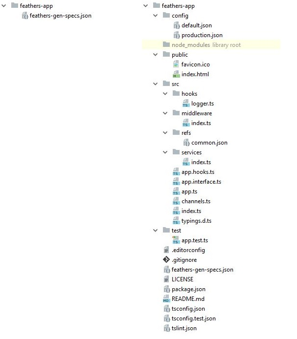
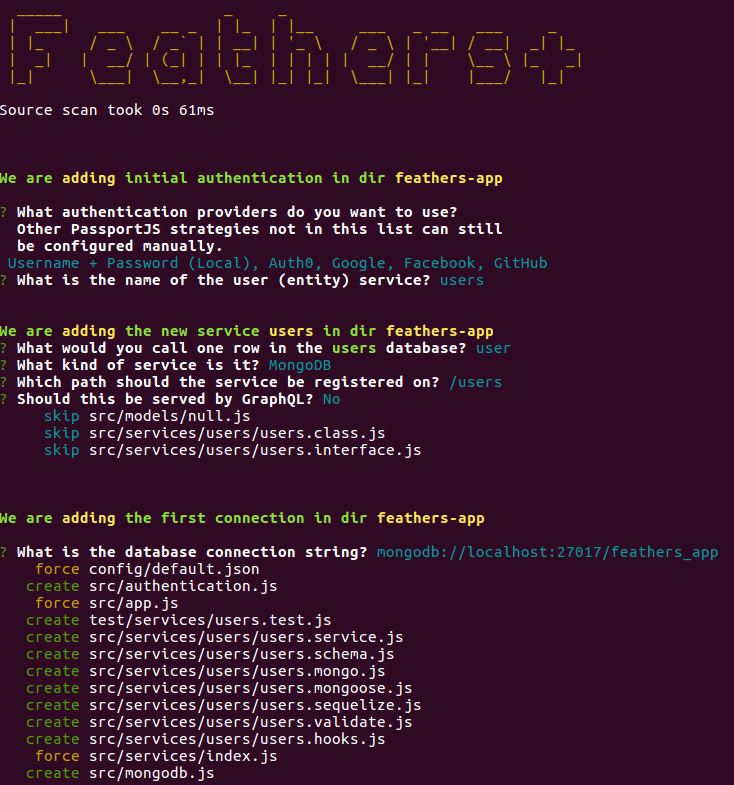
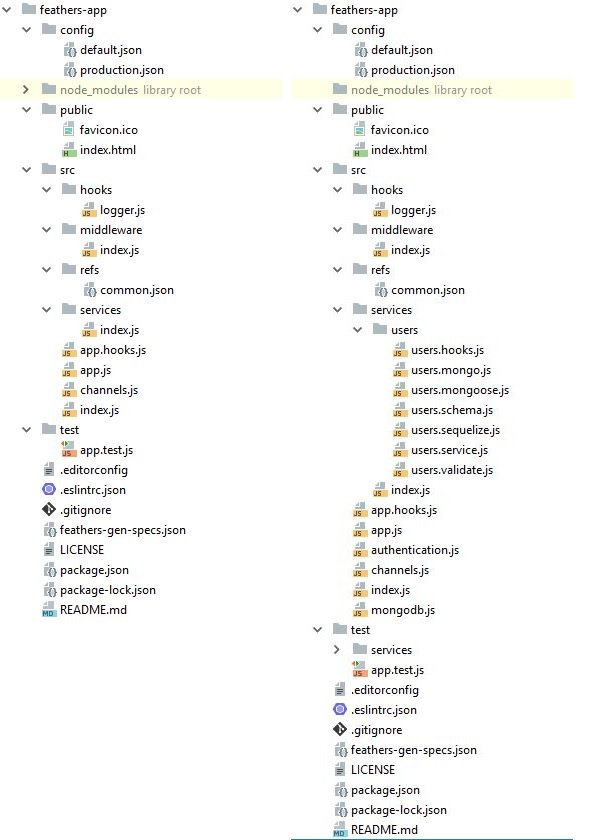

# Get Started

::: danger STOP
Until the generator is released, all references in the documentation to `@feathers-plus`
should be replaced with `@feathers-x`.
:::

## Installation

`npm i -g @feathers-plus/cli`

::: danger STOP
`generator-feathers-plus` is not automatically installed as a dependency
during the development period.

Do the following so that any change you make in @feathers-plus/generator-feathers-plus
will be immediately reflected in @feathers-plus/cli.

- Clone `@feathers-plus/generator-feathers-plus`.
- [Symlink](https://medium.com/trisfera/the-magic-behind-npm-link-d94dcb3a81af)
it into @feathers-plus/cli.
  - In @feathers-plus/generator-feathers-plus, run `npm link`.
  - In @feathers-plus/cli, run `npm link @feathers-plus/generator-feathers-plus`.
  The location containing the global @feathers-plus/cli will vary based on your OS.
  You can run `npm list -g` to see where global libraries are installed.
:::

## Comparision to @feathersjs/cli

@feathers-plus/cli, a.k.a. "cli-plus", is similar to @feathersjs/cli in that:
- It uses the same commends, e.g. `generate service`.
- It prompts with the same questions, e.g. "Which path should the service be registered on?"
- It generates the same modules with essentially identical code.

However with cli-plus also:
- Converts DB-agnostic JSON-schema models to the DB model each service is currently configured for. 
- Generates all the code needed for your GraphQL Query interface.
- Generates either JavaScript or TrueScript code; with semicolons or without. Converts apps between JS and TS.
- Regenerates you app without losing changes you've made. You stay up-to-date with enhancements and fixes.

## What the Generator Does

We've been writing code "by hand" in order to understand how basic Feathers works.
We will now start using Feathers generators since we have the background to understand what they produce.

#### Generators help eliminate boilerplate.

We've seen that Feathers, even when coded "by hand",
eliminates the majority of the boilerplate typically in a CRUD project.
Generators will eliminate even more.

:::tip Generators.
Feathers generators produce very little code because Feathers is so succinct.
You can easily understand the generated code because its no different from what we've been
coding "by hand" so far.
Some other frameworks make things “seem” easy by generating thousands of lines of code for you
and, in the process, making it almost impossible to implement anything not supported out of the box
by their generators.
:::

#### Generators structure your app.

The generated modules are structured as recommended by the Feathers team.

#### Generators handle database specifics.

The generators will generate code for different databases
so you don't have to investigate how to do so.

:::tip Switching between adapters.
You can change a service's database adapter while regenerating it.
This allows you, for example, to quickly mock up an app using the NeDB adapter,
and then convert it to Mongoose.
:::

## generate options

Let's generate a project having users who may be members of one or more teams.
We want to display teams with all their members

We first create a folder to contain the app, and then set its generator options.

```text
mkdir feathers-app
cd feathers-app
feathers-plus generate options
```

#### Prompts


- `Source scan took 0s 23ms`.
The generator scans the app to identify any custom code.
This will always be very fast,
taking much less time than what the `Yoeman` tool needs to start up.

- `The generator will not change the following modules`.
The generator can refresh many of the modules in your app,
updating them to the latest version of the generator.
It does this without changing any of your custom code.

The listed modules are ones which the generator will not update.
Once they are written, the generator will not refresh them.
Any changes you make will remain.
If you delete any of them, the generator will replace them.

This list is displayed as a convenience, so you can refer to it anytime by running
`generate options` and cancelling.

- `You have additionally prevented the following modules from being changed.`
You can prevent a.k.a. "freeze" modules to prevent the generator from refreshing them.
You normally would not do so but its useful to have the option.
The frozen modules are listed here for convenience.

- `Generate TypeScript code?` Defaults to no. Otherwise JavaScript code is generated.

- `Use semicolons?` Defaults to yes. Otherwise semicolons are not generated at the end of statements.

- `View module changes and control replacement (not recommended)?`
Defaults to no.
This is a Yeoman feature which allows you to inspect the changes to be made to any module,
and to decide whether to apply it.
Its useful when you are exploring the raw details of what the generator writes.

#### Folder

The feathers-app folder now contains one module.


- **feathers-gen-specs.json** contains the information used to generate the app.

#### feathers-gen-specs.json

```js
{
  "options": {
    "ver": "1.0.0",
    "inspectConflicts": false,
    "semicolons": true,
    "freeze": [],
    "ts": false
  },
  "app": {},
  "services": {}
}
```

The generator keeps the prompts used to generate the app in `feathers-gen-specs.json`.
It can regenerate your entire app from that and the custom code it finds in the modules.

:::tip Regeneration.
The generator will default to your previous choices if you rerun `feathers-plus generate options`.
It will make any needed changes to all modules if you change any of the options.
:::

:::tip Optional
You need not run `feathers-plus generate options` if your app will be in JavaScript with semicolons.
:::

## generate app

Next we generate the scaffolding for the app.

```text
feathers-plus generate app
```

#### Prompts


- `Project name`. Defaults to the folder name.

- `Description`. Optional description for the project.

- `What folder should the source files live in?`
Default `src`. The name of the folder containing the server code.

- `Which package manager are you using?` Default `npm`. The alternative is `yarn`.

- `What types of API are you making?` The options are
    - `REST` - HTTP. Default.
    - `Realtime via Socket.io` - Default. 
    - `Realtime via Primus`

#### Folders

The generator creates some
[JS modules](https://github.com/feathers-x/generator-feathers-plus/tree/master/examples/js/02-app/feathers-app/)
or [TS ones](https://github.com/feathers-x/generator-feathers-plus/tree/master/examples/ts/02-app/feathers-app/)
reflecting your choices.
The modules are properly wired together and structured as recommended by the Feathers team.

Below are the previous and the new app contents when JavaScript is generated.


and when TypeScript is generated.



- **config/** contains the configuration files for the app.
production.json values override default.json ones when in production mode,
i.e. when you run `NODE_ENV=production node path/to/your/server.js`.

- **node_modules/**. The generator installs the project dependencies here using either
npm, or yarn if that's installed.
The dependencies are enumerated in `package.json`.

- **public/** nontains the resources to be served.
A sample favicon and HTML file are included.

- **src/** contains the Feathers server.
    
    - **hooks/** contains your custom hooks,
    usually those general enough to be used with multiple services.
    A simple but useful logger is provided as an example.
        
    - **middleware/** contains your Express middleware.
    
    - **refs** contains definitions for fields which may reside in multiple database models.
        
    - **services/** will contain the services.
    
    - **index.?s** is used by node to start the app.
        
    - **app.?s** configures Feathers and Express.
    
    - **app.hooks.?s** contains hooks which are run for **all** services.
    
    - **channels.?s** contains the channels sending realtime events to clients.
    
    - **app.interface.ts** `??????????????????????????????????????`
    
    - **typings.d.ts** `??????????????????????????????????????????`
 
- **test/** contains the tests for the app.
app.test.?s tests that the index page appears, as well as 404 errors for HTML pages and JSON.

- **.editorconfig** is compatible with the [EditorConfig project](http://editorconfig.org/)
and helps developers define and maintain consistent coding styles among different editors and IDEs.

- **.gitignore** specifies intentionally untracked files which git, GitHub and other similar projects ignore.

- **feathers-gen-specs.json** contains the information used to generate the app.

- **LICENSE** contains the license so that people know how they are permitted to use it,
and any restrictions you're placing on it.
It defaults to the Feathers license.

- **package.json** contains information which npm, yarn
and other package managers need to install and use your package.

- **package-lock.json** is created by npm. It contains the versions of the module dependencies which are installed.
It exists only if the npm option is selected.

- **README.md** contains the documentation for the app.

- **tsconfig.json** `??????????????????????????????????????????`

- **tsconfig.test.json** `??????????????????????????????????????????`

- **tslint.json** `??????????????????????????????????????????`

- **yarn.lock**  is created by yarn. It contains the versions of the module dependencies which are installed.
It exists only if the yarn option is selected.


## Adding your code

`@feathersjs/cli`'s job ends when it generates the app scaffolding.
It doesn't know what you do afterwards with it.

`@feathers-plus/cli` (also known as `cli-plus`)is a `round-trip` generator.
Round-trip generators can take previously generated code, identify custom changes made to it,
and regenerate the code (maybe using different responses to the prompts)
along with those custom changes.

Cli-plus completes the round trip: `generate -> customize -> regenerate -> customize -> ...`.

The developer and cli-plus are in a more collaborative relationship.
They can work co-operatively on the scaffolding code.

#### Retain developer modifications

You will usually add your own code to the generated modules.
Cli-plus can identify such additional code, as long as certain standards are followed,
and it will retain that added code when regenerating modules.

Some of the code generated by cli-plus is identified as default code which you may want to customize.
Any customized code replacing the default code is also retained when modules are regenerated.

Let's look at a trivial example of these features.
@feathersjs/cli and cli-plus both create module `src/index.js` when `generate app` is run.
The cli-plus module has some extra decorative comments:
```js
server.on('listening', () => {
  // !<DEFAULT> code: listening_log
  logger.info('Feathers application started on http://%s:%d', app.get('host'), port);
  // !end
});

// !code: end // !end
```

Starting the server produces the expected log:
```text
Feathers application started on http://localhost:3030
```

The lines between `// !<DEFAULT> code: listening_log` and `// !end` contain default code named `listening_log`.

The `// !code: end // !end` line identifies a location named `end` where additional lines may be added.

Let's change the code to:
```js
server.on('listening', () => {
  // !code: listening_log <-- Note that <DEFAULT> was removed.
  logger.info('Hello world on http://%s:%d', app.get('host'), port);
  // !end
});

// !code: end
logger.info('Initialization complete. Waiting for server to start.'); 
// !end
```

Starting the server now logs:
```text
Initialization complete. Waiting for server to start.
Hello world on http://localhost:3030
```

:::danger A common error
Notice the `<DEFAULT>` tag was removed from listening_log along with changing the default code itself.
Any code changes you make in location_log will be lost on regeneration if you don't remove that `<DEFAULT>`.
:::

Let's say you originally ran `generate app` selecting only `socket.io` as a transport.
You then changed the code in `src/index.js` as described above.
Later on you realize you also need `REST` as a transport.
You can just rerun `generate app` with cli-plus and select both transports.
The regenerated modules will contain the code changes you made above.

#### Where can code be added?

The short answer is "just about anywhere".
Insertion points are available anywhere it makes any sense to add code.

Here is a typical `src/services/index.js`:
```js
// Configure the Feathers services. (Can be re-generated.)
let comment = require('./comment/comment.service');
let like = require('./like/like.service');
let post = require('./post/post.service');
let relationship = require('./relationship/relationship.service');
let user = require('./user/user.service');

let graphql = require('./graphql/graphql.service');
// !code: imports // !end
// !code: init // !end

let moduleExports = function (app) { // eslint-disable-line no-unused-vars
  app.configure(comment);
  app.configure(like);
  app.configure(post);
  app.configure(relationship);
  app.configure(user);

  app.configure(graphql);
  // !code: func_return // !end
};

// !code: exports // !end
module.exports = moduleExports;

// !code: funcs // !end
// !code: end // !end
```

All the modules follow the same standards, e.g. starting with `imports` and `init`,
and ending with `funcs` and `end`.
Functions tend to end with names like `func_return` so you can add code to them.
You can replace or mutate the required modules at `init` as well as adding any initialization code.
You can modify or replace the exported value at `exports`.

Its trivial to add insertion points into the generator, so create an issue if you need additional ones.
We'll add that insertion point, and you just regenerate the app to be able to use it.


#### More realistic code customization

The previous example gets the idea across but its too trivial to appreciate the impact of the feature.

Cli-plus generates a module for every service named `src/services/serviceName/serviceName. validate.js`.
It contains JSON-schema which may be used to validate record contents before create, update and patch calls.
Part of the code may be similar to:
```js
const base = merge({},
  // !<DEFAULT> code: base
  {
    $schema: "http://json-schema.org/draft-05/schema",
    title: "User",
    description: "User database.",
    required: [
      "uuid",
      "email",
      "firstName",
      "lastName"
    ],
    properties: {
      _id: {
        type: ID
      },
      uuid: {
        type: ID
      },
      email: {
        type: "string"
      },
      firstName: {
        type: "string", maxLength: 30,
      },
      lastName: {
        type: "string", maxLength: 30,
      }
    }
  },
  // !end
  // !code: base_more // !end
);
```

This 'base' JSON-schema is derived from the **service model**.
(The service model is a new concept cli-plus introduces which is explained below.)
It is the basis for the validation schemas used for the different types of calls.

The developer may replace the default code named `base` to suit his use case.

It would probably be better however to mutate the default schema by adding, mutation or removing
properties by adding custom code to `base_more`, e.g.:
```js
// !code: base_more
{
  properties: {
    firstName: { minLength: 45 },
    initial: { type: 'string', maxLength: 1 }
  }
}
// !end
```
This would be better because now, when you change the `service model`,
cli-plus will make appropriate changes to the base schema in its default code.
This is better than remembering to modify the base schema manually every time you change the service model.

#### GraphQL examples

One of the main features of cli-plus is its ability to generate a GraphQL endpoint as well as the necessary resolvers.
A large number of carefully coded resolvers need to defined in a reasonably sized project,
so automatically generating these resolvers is a valuable feature.

However resolvers often have to be customized in unexpected ways.
You may need to change the sort order.
You may need to set props in `context.params` for certain hooks.
There is no practical end to the potential customizations.

Here are some code snippets in src/services/graphql/service.resolvers.js
which cli-plus may generate for a GraphQL endpoint:
```js
    // Feathers service resolvers
    User: {

      // comments: [Comment!]
      comments:
        // !<DEFAULT> code: resolver-User-comments
        (parent, args, content, ast) => {
          const feathersParams = convertArgs(args, content, ast, {
            query: { authorUuid: parent.uuid, $sort: undefined }, paginate: false
          });
          return comments.find(feathersParams).then(extractAllItems);
        },
        // !end

      // fullName: String!
      fullName:
        // !<DEFAULT> code: resolver-User-fullName-non
        (parent, args, content, ast) => { throw Error('GraphQL fieldName User.fullname is not calculated.'); },
        // !end

      // posts(query: JSON, params: JSON, key: JSON): [Post!]
      posts:
        // !<DEFAULT> code: resolver-User-posts
        (parent, args, content, ast) => {
          const feathersParams = convertArgs(args, content, ast, {
            query: { authorUuid: parent.uuid, $sort: undefined }, paginate: false
          });
          return posts.find(feathersParams).then(extractAllItems);
        },
        // !end
    },
```
You can customize them as you wish, by defining a `$sort` order for example.

`fullname` is a calculated field.
Cli-plus, rather than inventing some specialized way for you to indicate what the calculation is,
just creates some default code for you to replace with the calculation.
For example
```js
      // fullName: String!
      fullName:
        // !code: resolver-User-fullName-non
        (parent, args, content, ast) => `${parent.firstName} ${parent.lastName}`,
        // !end
```

#### Avoiding customization

You can have cli-plus generate modules and then prevent it from making changes thereafter to some of them,
by using the `options.freeze` prop in `feathers-gen-specs.json`.

#### Some details

The leaders for custom code may be : `// !code:`, `// !<> code:`, `//!code:`, or `// ! code:`.

The trailers may be: `// !end`, or `//!end`


## generate authentication

Let us next generate authentication for the app. This will generate
- The authentication code itself.
- A service for the users table.
- A connection string for the database containing the users table.

```text
feathers-plus generate authentication
```

#### Prompts




- `What types of API are you making?` The options are
    - `REST` - HTTP. Default.
    - `Realtime via Socket.io` - Default. 
    - `Realtime via Primus`

#### Folders

The generator adds some modules to the
[JS folder](https://github.com/feathers-x/generator-feathers-plus/tree/master/examples/js/03-app/feathers-app/)
or [TS one](https://github.com/feathers-x/generator-feathers-plus/tree/master/examples/ts/03-app/feathers-app/).

Below are the previous and the new app contents when JavaScript is generated.



and when TypeScript is generated.


- **config/** contains the configuration files for the app.
production.json values override default.json ones when in production mode,
i.e. when you run `NODE_ENV=production node path/to/your/server.js`.