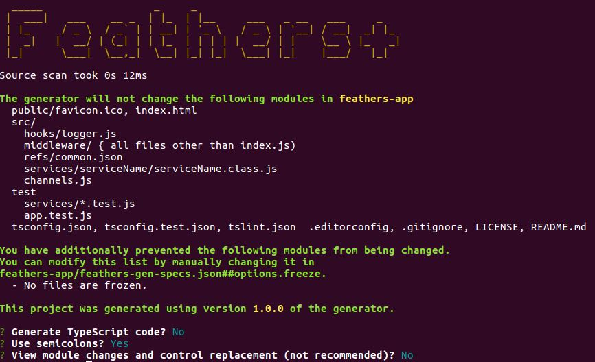

# Quick-start

::: danger STOP
Until the generator is released, all references in the documentation to `@feathers-plus`
should be replaced with `@feathers-x`.
:::

## Installation

`npm i -g @feathers-plus/cli`

::: danger STOP
`generator-feathers-plus` is not automatically installed as a dependency
during the development period.

Do the following so that any change you make in @feathers-plus/generator-feathers-plus
will be immediately reflected in @feathers-plus/cli.

- Clone `@feathers-plus/generator-feathers-plus`.
- [Symlink](https://medium.com/trisfera/the-magic-behind-npm-link-d94dcb3a81af)
it into @feathers-plus/cli.
  - In @feathers-plus/generator-feathers-plus, run `npm link`.
  - In @feathers-plus/cli, run `npm link @feathers-plus/generator-feathers-plus`.
  The location containing the global @feathers-plus/cli will vary based on your OS.
  You can run `npm list -g` to see where global libraries are installed.
:::

## Comparision to @feathersjs/cli

The cli-plus is similar to @feathersjs/cli in that:
- It uses the same commends, e.g. `generate service`.
- It prompts with the same questions, e.g. "Which path should the service be registered on?"
- It generates the same modules with pretty much identical code.

However @feathers-plus/cli also:
- JSON-schema models are converted to the DB model each service is currently configured for. 
- Generates all the code needed for the GraphQL Query interface.
- Generates either JavaScript or TrueScript code; with semicolons or without. Converts apps between JS and TS.
- You can regenerate you app without losing changes you've made. Stay up-to-date with enhancements and fixes.

## What the Generator Does

We've been writing code "by hand" in order to understand how basic Feathers works.
We will now start using Feathers generators since we have the background to understand what they produce.

#### Generators help eliminate boilerplate.

We've seen that Feathers, even when coded "by hand",
eliminates the majority of the boilerplate typically in a CRUD project.
Generators will eliminate even more.

:::tip Generators.
Feathers generators produce very little code because Feathers is so succinct.
You can easily understand the generated code because its no different from what we've been
coding "by hand" so far.
Some other frameworks make things “seem” easy by generating thousands of lines of code for you
and, in the process, making it almost impossible to implement anything not supported out of the box
by their generators.
:::

#### Generators structure your app.

The generated modules are structured as recommended by the Feathers team.

#### Generators handle database specifics.

The generators will generate code for different databases
so you don't have to investigate how to do so.

## generate options


We first create a folder to contain the app, and then set its generator options.

```text
mkdir feathers-app
cd feathers-app
feathers-plus generate options
```

#### Prompts



- `Source scan took 0s 23ms`.
The generator scans the app to identify any custom code.
This will always be very fast,
taking much less time than what `Yoeman` needs to start up.

- `The generator will not change the following modules`.
The generator can refresh many of the modules in your app,
updating them to the latest version of the generator.
It does this without changing any of your custom code.

The listed modules are ones which the generator will not update.
Once they are written, the generator will not refresh them.
Any changes you make will remain.
If you delete any of them, the generator will replace them.

This list is displayed as a convenience, so you can refer to it anytime by running
`generate options` and cancelling.

- `You have additionally prevented the following modules from being changed.`
You can prevent a.k.a. "freeze" modules to prevent the generator from refreshing them.
You normally would not do so but its useful to have the option.
The frozen modules are listed here for convenience.

- `Generate TypeScript code?` Otherwise JavaScript code is generated.

- `Use semicolons?` Otherwise semicolons are not generated at the end of statements.

- `View module changes and control replacement (not recommended)?`
Usually no.
This is a Yeoman feature which allows you to inspect the changes to be made to any module,
and to decide whether to apply it.
Its useful when you are exploring the raw details of what the generator writes.

#### Directory

The feathers-app directory now contains just one module.


#### feathers-gen-specs.json

```js
{
  "options": {
    "ver": "1.0.0",
    "inspectConflicts": false,
    "semicolons": true,
    "freeze": [],
    "ts": false
  },
  "app": {},
  "services": {}
}
```

The generator keeps the prompts used to generate the app in `feathers-gen-specs.json`.
It can regenerate your entire app from that and the custom code it finds in the modules.

:::tip Regeneration.
The generator will default to your previous choices if you rerun `feathers-plus generate options`.
It will make any needed changes to the modules if you change any of the options.
:::

:::tip Defaults
`feathers-plus generate options` does not have to run if your app will be in JavaScript with semicolons.
:::

## generate app

Now let's write a new project using the Feathers generators.

This project will have users who may be members of one or more teams.
We want to display teams with all their members.

### Create the app

The first thing we do is generate the basic app. For that, we will first have to create and move into a new folder:

```
mkdir feathers-app
cd feathers-app
```

Then we can run:

```
feathers generate app
```


The generator creates some
[modules](https://github.com/feathersjs/feathers-docs/blob/master/examples/step/02/gen1/)
reflecting your choices.
The modules are properly wired together and structured as recommended by the Feathers team.

They are mostly [boilerplate](https://en.wikipedia.org/wiki/Boilerplate_code)
and organized as follows:


### Generated modules

#### config/
 
Contains the configuration files for the app.
[production.json](https://github.com/feathersjs/feathers-docs/blob/master/examples/step/02/gen1/config/production.json)
values override
[default.json](https://github.com/feathersjs/feathers-docs/blob/master/examples/step/02/gen1/config/default.json)
ones when in production mode,
i.e. when you run `NODE_ENV=production node path/to/your/server.js`.

#### node_modules/

The generator installs the project dependencies here using either
[npm](https://docs.npmjs.com/), or [yarn](https://yarnpkg.com/en/) if that's installed.
The dependencies are enumerated in `package.json`.

#### public/
 
Contains the resources to be served.
A sample favicon and
[HTML file](https://github.com/feathersjs/feathers-docs/blob/master/examples/step/02/gen1/public/index.html)
are included.

#### src/
 
Contains the Feathers server.
    
- **hooks/** contains your custom hooks,
usually those general enough to be used with multiple services.
A simple but useful
[logger](https://github.com/feathersjs/feathers-docs/blob/master/examples/step/02/gen1/src/hooks/logger.js)
is provided as an example.
    
- **middleware/** contains your Express middleware.
    
- **services/** will contain the services.

- [index.js](https://github.com/feathersjs/feathers-docs/blob/master/examples/step/02/gen1/src/index.js)
is used by node to start the app.
    
- [app.js](https://github.com/feathersjs/feathers-docs/blob/master/examples/step/02/gen1/src/app.js)
configures Feathers and Express.

- [app.hooks.js](https://github.com/feathersjs/feathers-docs/blob/master/examples/step/02/gen1/src/app.hooks.js)
contains hooks which have to run for **all** services.
**We have not covered this capability before.**
You can configure such hooks
[like this.](https://github.com/feathersjs/feathers-docs/blob/master/examples/step/02/gen1/src/app.js#L43)
 
#### test/

Contains the tests for the app.
[app.test.js](https://github.com/feathersjs/feathers-docs/blob/master/examples/step/02/gen1/test/app.test.js)
tests that the index page appears, as well as 404 errors for HTML pages and JSON.

#### [.editorconfig](https://github.com/feathersjs/feathers-docs/blob/master/examples/step/02/gen1/.editorconfig)
is compatible with the [EditorConfig project](http://editorconfig.org/)
and helps developers define and maintain consistent coding styles among different editors and IDEs.

#### [.eslintrc.json](https://github.com/feathersjs/feathers-docs/blob/master/examples/step/02/gen1/.eslintrc.json)
contains defaults for liniting your code with
[ESLint](http://eslint.org/docs/user-guide/getting-started).

#### [.gitignore](https://github.com/feathersjs/feathers-docs/blob/master/examples/step/02/gen1/.gitignore)
specifies
[intentionally untracked files](https://git-scm.com/docs/gitignore)
which
[git](https://git-scm.com/),
[GitHub](https://github.com/)
and other similar projects ignore.

#### [.npmignore](https://github.com/feathersjs/feathers-docs/blob/master/examples/step/02/gen1/.npmignore)
specifies
[files which are not to be published](https://docs.npmjs.com/misc/developers#keeping-files-out-of-your-package)
for distribution.

#### [LICENSE](https://github.com/feathersjs/feathers-docs/blob/master/examples/step/02/gen1/LICENSE)
contains the [license](https://docs.npmjs.com/files/package.json#license)
so that people know how they are permitted to use it, and any restrictions you're placing on it.

It defaults to the Feathers license.

#### [package.json](https://github.com/feathersjs/feathers-docs/blob/master/examples/step/02/gen1/package.json)
contains [information](https://docs.npmjs.com/files/package.json)
which
[npm](https://docs.npmjs.com/),
[yarn](https://yarnpkg.com/en/)
and other package managers need to install and use your package.

### What's next?

The generated code will look familiar.
It contains nothing more than what we have covered previously.
The main advantages of the Feathers generators are

- Generators structure your app.
The generated modules are structured as recommended by the Feathers team.

- Generators write the repetitive boilerplate
so you don't have to.

- Generators handle database specifics.
The generators will generate code for different databases
so you don't have to investigate how to do so.
