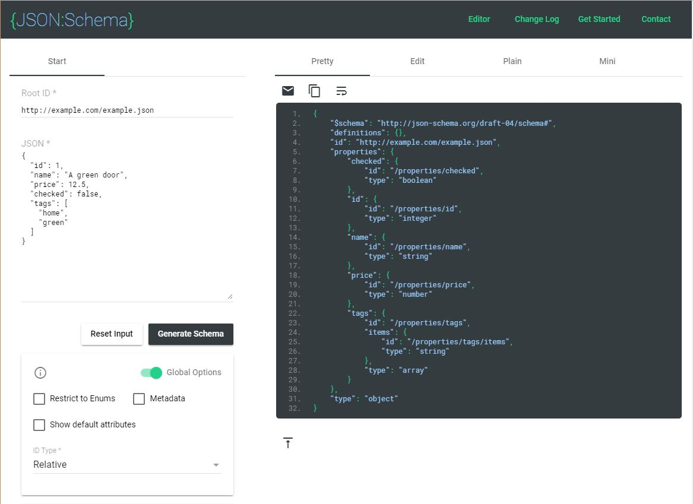
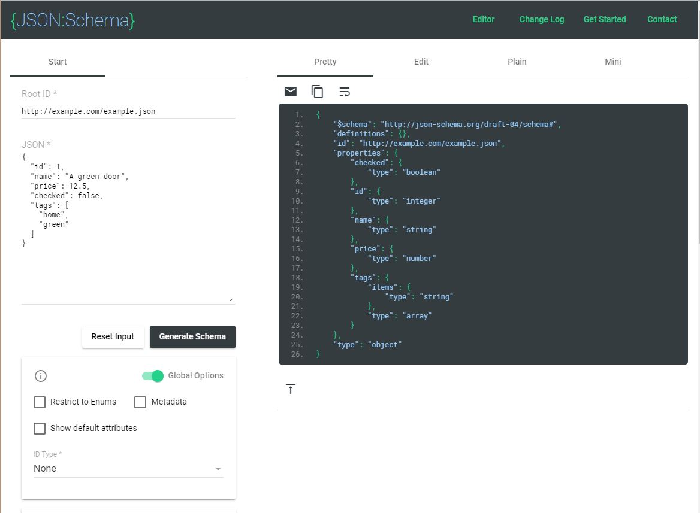
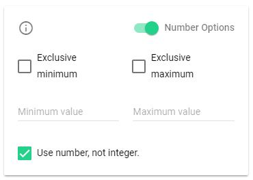
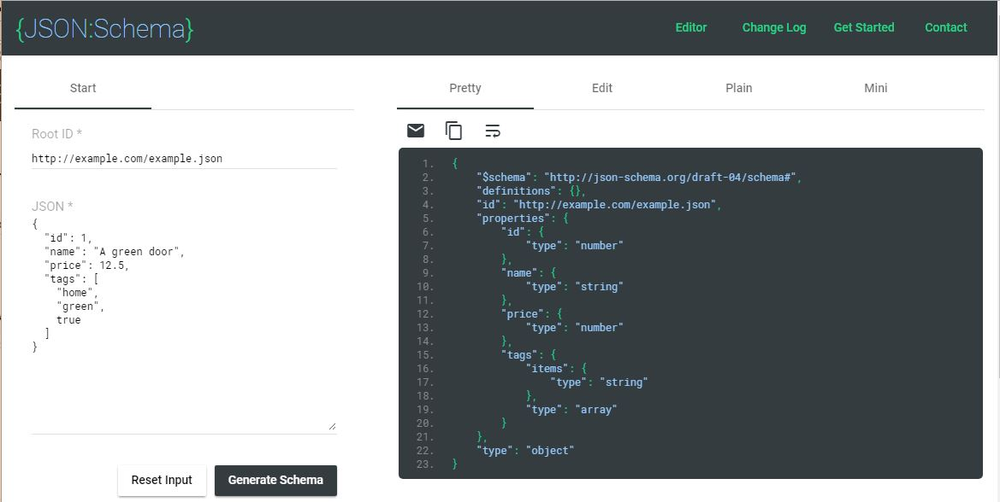
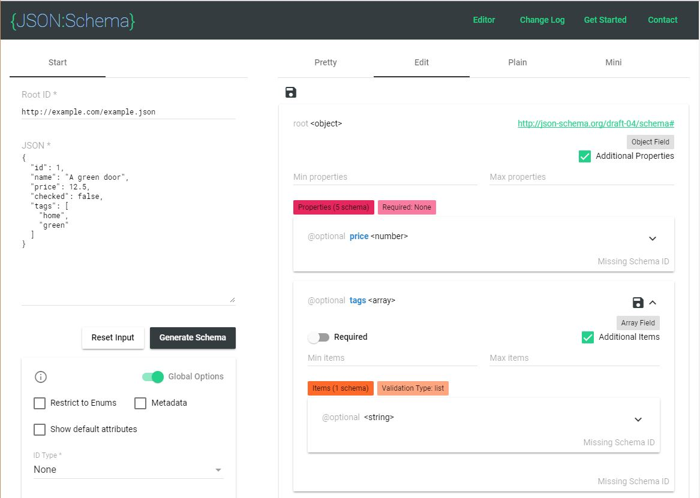
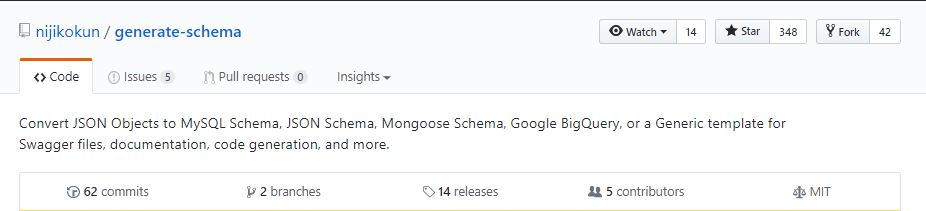
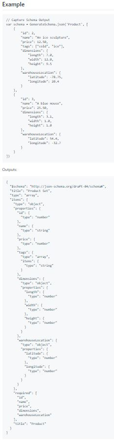
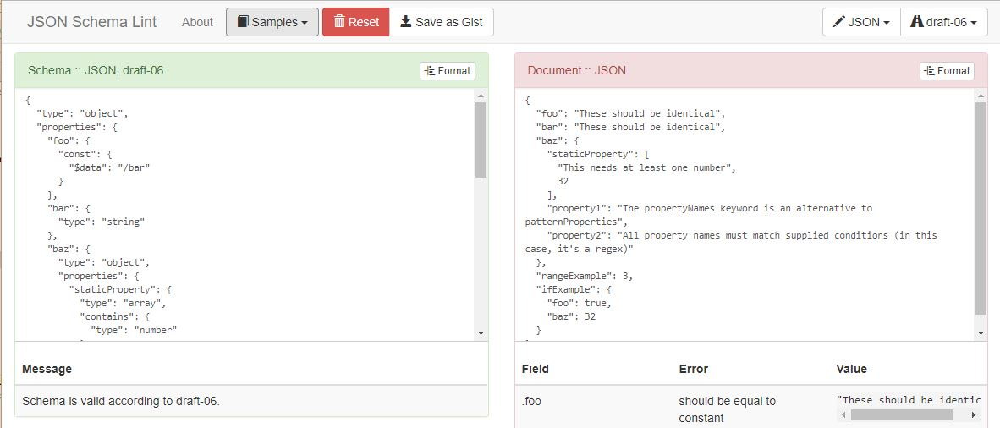

## Writing JSON-schema

Here is a typical JSON-schema which contains no field validation:
```javascript
const productJsonSchema = {
    type: 'object',
    properties: {
        _id: { oneOf: [{ type: 'string' }, { type: 'object' }] }, // handle both MongoDB and NeDB
        checked: { type: 'boolean' },
        name: { type: 'string' },
        price: { type: 'number' },
        tags: {
            type: 'array',
            items: { type: 'string' },
        },
        updatedAt: { type: 'number', format: 'date-time', default: Date.now },
    },
}
```

Feathers Models can default the `type` properties, so you can write more concisely:
```javascript
const productJsonSchema = {
    properties: {
        _id: {},
        checked: { type: 'boolean' },
        name: {},
        price: { type: 'number' },
        tags: { items: {} },
        updatedAt: { format: 'date-time', default: Date.now },
    },
}
```

As you can see, JSON-schema is fairly straightforward.
It also has extensive capabilities for validating your data.

> **ProTip:** You should read
[this excellent tutorial](https://code.tutsplus.com/tutorials/validating-data-with-json-schema-part-1--cms-25343)
on JSON-schema written by the author of
[`ajv`](https://github.com/epoberezkin/ajv).
The Feathers common hook
[`validateSchema`](../../api/hooks-common#validateSchema.md)
uses `ajv` to validate data.

---

> **ProTip:** We are not certifying the utilities and websites mentioned below work flawlessly.
They are part of the JSON-schema ecosystem and may prove useful.
We welcome your feedback on them.

## Exploring JSON-schema

You can also convert a JSON object to JSON-schema online at
[https://jsonschema.net](https://jsonschema.net).
This provides an interesting way to explore JSON-schema.



The first thing to do is change `ID Type` from `Relative` to `None`,
followed by clicking `Generate Schema`.



The `type` of each JSON data property is specified in the JSON-schema.
The `tags` array is typed as an `array` with its `items`, i.e. elements, typed as `string`.

You can play around with the input JSON, seeing how your changes affect the JSON-schema.

## Exploring global options

You can control options for the conversion in the area below `Generate Schema`.
Enable `Number Options` and check `Use number, not integer`.



Followed by clicking `Generate Schema`.



You can see that `"type": "number"` is now used for all numeric values.

> **ProTip:** Feathers Models should use `"type": "number"`.

Now check the `Metadata` and `Show default attributes` boxes in `Global Options`,
followed by clicking `Generate Schema`.


You can see how the JSON-schema grows in sophistication.

### Exploring field options

Refresh the page to get the original `https://jsonschema.net/#/editor` page.

Once again change `ID Type` from `Relative` to `None`,
followed by clicking `Generate Schema`.
This let's us back to our starting point.


Click the `Edit` icon to see options for each field in the JSON-schema.



In the `@optional tags <array>` panel, click the down arrow in the inner `@optional <string>` panel
to see all the options for the array `tags`.


- `Min items` to 1.
- `Max items` to 4.
- `Minimum length` to 2.
- `Maximum length` to 16 and **press the `tab` key to properly exit this input field.**


- Click the diskette/drive icon in the `@optional tags <array>` panel to save your changes.
- **Do not** click `Generate Schema`.
- Click the `Pretty` button at the top of the page.


You can see that validation rules have been added to the `tags` entry in the JSON-schema.

### Using existing data collections

Some records in a collection many differ from other records.
In one record a field may have a numeric value, while in another it may be `null`.
Some records may have fields which others do not.

Utilities exist to scan all the records in your collection
and produce a consolidated JSON-schema.
You may find these useful in some situations.

Here are two of them.

#### [generate-schema](https://github.com/nijikokun/generate-schema)





#### [json-schema-generator](https://github.com/krg7880/json-schema-generator)


### Using existing database schemas

If you have existing schemas
and you'd like to take advantage of the new features of Feathers Models,
there are utilities that will convert them into JSON-Schemas:

[`mongoose-schema-jsonschema`](https://github.com/DScheglov/mongoose-schema-jsonschema)
and [`mongoose-jsonschema`](https://www.npmjs.com/package/mongoose-jsonschema)
convert Mongoose schema to JSON-schema.

There are
[several utilities available](https://www.google.com/search?q=sequelize+to+json+schema&oq=sequelize+to+json+schema&aqs=chrome..69i57j0j69i60.5582j0j4&sourceid=chrome&ie=UTF-8)
available to convert Sequelize models.

Search for utilities for other databases.

### Verifying against JSON

Once you have your JSON-schema, you can check it acts as expected
by having it verify JSON which you know is valid by, for example,
using the [online JSON Schema Lint](https://jsonschemalint.com)
site.

Click the `Samples dropdown and choose `Sample draft-06 schema and valid document`.



Or `Sample draft-06 schema and **invalid** document`.


> **ProTip:** You may have extracted your JSON from someplace and its hard to read.
You have a long JSON which is invalid --- someplace.
You may find [JSONLint](https://jsonlint.com/) useful to prettify and debug your JSON.

### Linting you JSON-schema

How do you check your JSON-schema is valid?
Well every JSON-schema is itself a JSON object
and the official standards [JSON-schema org](http://json-schema.org/)
has meta-schemas which specify what JSON-schema should look like.

So you can download the [Meta-schemas](http://json-schema.org/documentation.html)
and use them to verify your JSON-schema, exactly the same way you'd use JSON-schema to verify JSON.

### Verifying against data collections

You can verify the compatibility of your JSON-schema and your data collection
by using the JSON-schema to verify your collection.

You can use the Feathers common hook
[`validateSchema`](../../api/hooks-common#validate-schema.md).
Or you may decide its more convenient to call
[`ajv`](https://github.com/epoberezkin/ajv)
directly.

### Verification in tests and build chains

You might some other ajv-based utilities useful.

[`grunt-jsonschema-ajv`](https://github.com/SignpostMarv/grunt-jsonschema-ajv)
is a [Grunt](https://en.wikipedia.org/wiki/Grunt_(software))
plugin for validating files against JSON Schema with ajv.

[`chai-ajv-json-schema`](https://github.com/peon374/chai-ajv-json-schema/blob/master/index.js)
purports to verify data using the `expect` syntax.

### $ref: Modularizing definitions

The field `createdAt` may be used in several schemas.
It would be advantageous to define its characteristics
-- such as its minLength and maxLength --
in one place rather than everywhere its used.

We can do this with the `$ref` keyword.
```json
// src/services/comment/comment.schema.js refers to an external property definition
{
  properties: {
    // ...
    createdAt: { $ref: 'common.json#/definitions/created_at'}
  }
}

// src/refs/common.json contains the definition
{
  "description": "Common JSON-schema definitions.",
  "definitions": {
    "created_at": {
      "description": "Creation date-time.",
      "example": "2018-01-01T01:01:01.001Z",
      "format": "date-time",
      "readOnly": true,
      "type": "string"
    },
  }
}

// src/services/comment/comment.validate.js will be generated with
const base = merge({},
  {
    properties: {
      createdAt: {
        description: "Creation date-time.",
        example: "2018-01-01T01:01:01.001Z",
        format: "date-time",
        readOnly: true,
        type: "string"
      }
    }
  },
);

// src/services/comment/comment.mongoose.js will be generated with
{
  createdAt: String
},
```

The definition of `createdAt` in common.json will be merged into the field in comment.schema.js.

You can create a $ref file like common.json with all the common elements in your app.
Should the need arise to change some, such as increasing the length of the `address` field,
you need change it in only one place, and then regenerate the project.

You can read about additional features of $ref in the
[JSON-schema tutorial](https://code.tutsplus.com/tutorials/validating-data-with-json-schema-part-2--cms-25640).


### Summary

The [online JSON-schema editor](https://jsonschema.net)
provides an easy introduction to JSON-schema,
as well as a useful generator of simple JSON-schema.

You will have to read the
[tutorial](https://code.tutsplus.com/tutorials/validating-data-with-json-schema-part-1--cms-25343)
sooner or later to understand how to add validation criteria.

There are also ways to generate your JSON-schema from your data,
and from existing database schemas.

Finally you can decide to check your JSON-schema against your existing data.